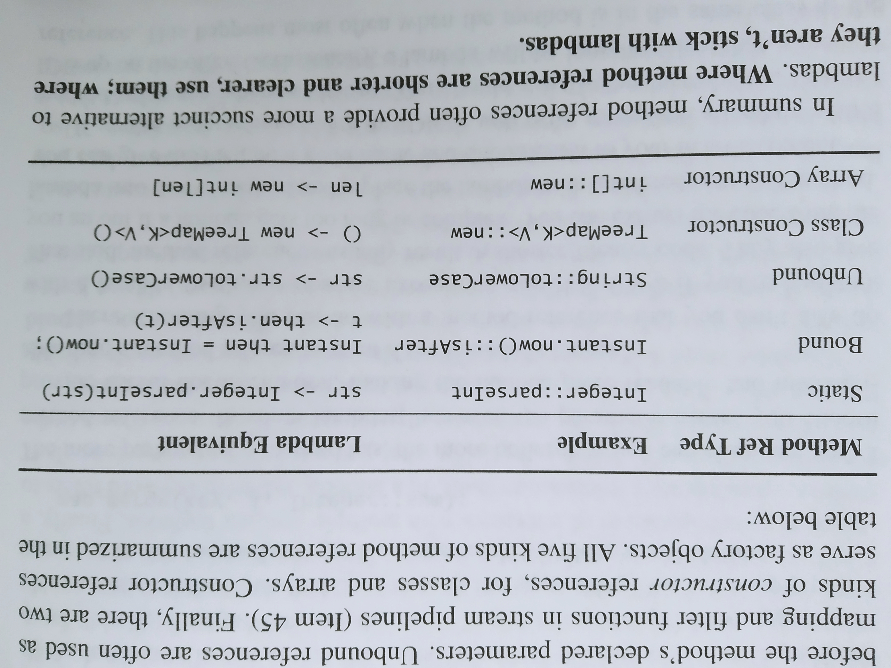
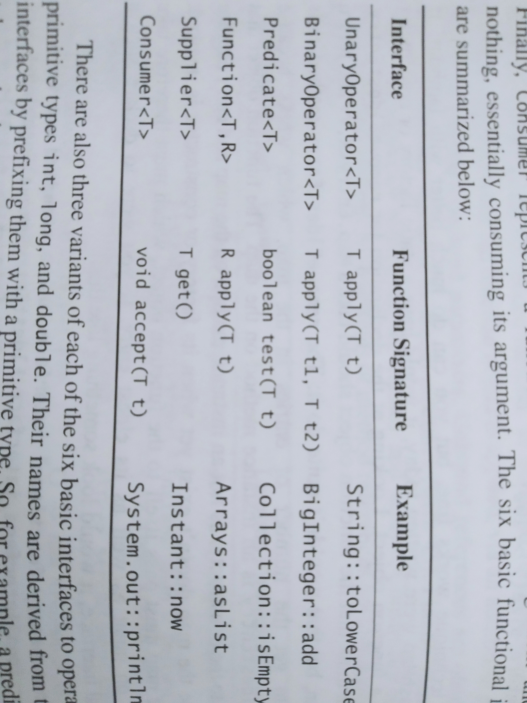
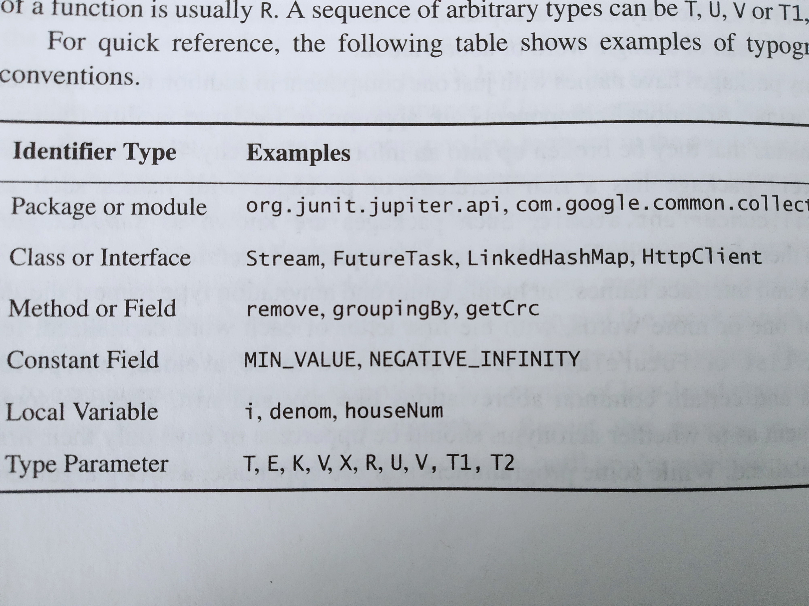
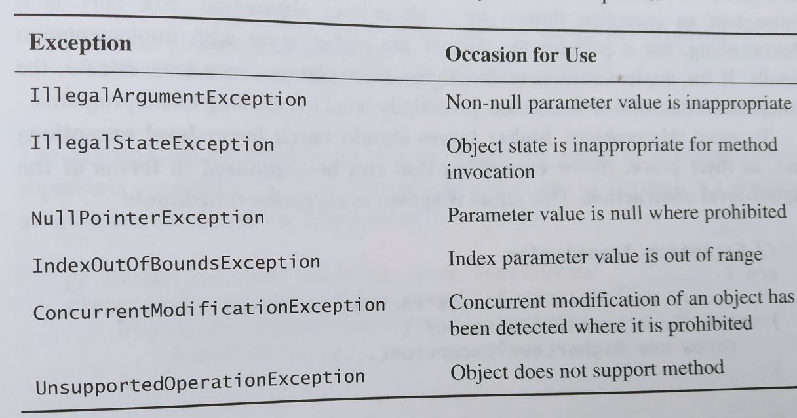

# Effective Java - 3rd Edition Notes


## Table of Contents
* [7 Lambdas and Streams](#7-lambdas-and-streams)   
    * [Item 42: Prefer lambdas to anonymous classes](#item-42-prefer-lambdas-to-anonymous-classes)   
    * [Item 43: Prefer method references to lambdas](#item-43-prefer-method-references-to-lambdas) 
    * [Item 44: Favor the use of standard functional interfaces](#item-44-favor-the-use-of-standard-functional-interfaces)         
* [8 Methods](#8-methods)   
    * [Item 49: Check parameters for validity](#item-49-check-parameters-for-validity)    
    * [Item 50: Make defensive copies when needed](#item-50-make-defensive-copies-when-needed)   
    * [Item 51: Design method signatures carefully](#item-51-design-method-signatures-carefully)   
    * [Item 52: Use overloading judiciously](#item-52-use-overloading-judiciously)   
    * [Item 53: Use varargs judiciously](#item-53-use-varargs-judiciously)   
    * [Item 54: Return empty collections or arrays, not nulls](#item-54-return-empty-collections-or-arrays-not-nulls)   
    * [Item 55: Return optionals judiciously](#item-55-return-optionals-judiciously)   
    * [Item 56: Write doc comments for all exposed api elements](#item-56-write-doc-comments-for-all-exposed-api-elements)
* [9 General Programming](#9-general-programming)    
    * [Item 57: Minimize the scope of local variables](#item-57-minimize-the-scope-of-local-variables)   
    * [Item 58: Prefer for-each loops to traditional for loops](#item-58-prefer-for-each-loops-to-traditional-for-loops)   
    * [Item 59: Know and use the libraries](#item-59-know-and-use-the-libraries)   
    * [Item 60: Avoid float and double if exact answers are required](#item-60-avoid-float-and-double-if-exact-answers-are-required)   
    * [Item 61: Prefer primitive types to boxed primitives](#item-61-prefer-primitive-types-to-boxed-primitives)   
    * [Item 62: Avoid strings where other types are more appropriate](#item-62-avoid-strings-where-other-types-are-more-appropriate)   
    * [Item 63: Beware the performance of string concatenation](#item-63-Beware-the-performance-of-string-concatenation)   
    * [Item 64: Refer to objects by their interfaces](#item-64-refer-to-objects-by-their-interfaces)   
    * [Item 65: Prefer interfaces to reflection](#item-65-prefer-interfaces-to-reflection)   
    * [Item 66: Use native methods judiciously](#item-66-use-native-methods-judiciously)   
    * [Item 67: Optimize judiciously](#item-67-optimize-judiciously)   
    * [Item 68: Adhere to generally accepted naming conventions](#item-68-adhere-to-generally-accepted-naming-conventions)   
* [10 Exceptions](#10-exceptions)    
    * [Item 69: Use exceptions only for exceptional conditions](#item-69-use-exceptions-only-for-exceptional-conditions)
    * [Item 70: Use checked exceptions for recoverable conditions and runtime exceptions for programming errors](#item-70-use-checked-exceptions-for-recoverable-conditions-and-runtime-exceptions-for-programming-errors)
    * [Item 71: Avoid unnecessary use of checked exceptions](#item-71-avoid-unnecessary-use-of-checked-exceptions)
    * [Item 72: Favor the use of standard exceptions](#item-72-favor-the-use-of-standard-exceptions)
    * [Item 73: Throw exceptions appropriate to the abstraction](#item-73-throw-exceptions-appropriate-to-the-abstraction)
    * [Item 74: Document all exceptions thrown by each method](#item-74-document-all-exceptions-thrown-by-each-method)
    * [Item 75: Include failure-capture information in detail messages](#item-75-include-failure-capture-information-in-detail-messages)
    * [Item 76: Strive for failure atomicity](#item-76-strive-for-failure-atomicity)
    * [Item 77: Don't ignore exceptions](#item-77-dont-ignore-exceptions)
* [11 Concurrency](#11-concurrency)   
    * [Item 78: Synchronize access to shared mutable data](#item-78-synchronize-access-to-shared-mutable-data)
    * [Item 79: Avoid excessive synchronization](#item-79-avoid-excessive-synchronization)
    * [Item 80: Prefer executors, tasks, and streams to threads](#item-80-prefer-executors-tasks-and-streams-to-threads)
    * [Item 81: Prefer concurrency utilities to wait and notify](#item-81-prefer-concurrency-utilities-to-wait-and-notify)
    * [Item 82: Document thread safety](#item-82-document-thread-safety)
    * [Item 83: Use lazy initialization judiciously](#item-83-use-lazy-initialization-judiciously)
    * [Item 84: Don't depend on the thread scheduler](#item-84-dont-depend-on-the-thread-scheduler)
* [12 Serialization](#12-serialization)   
    * [Item 85: Prefer alternatives to Java serialization](#item-85-prefer-alternatives-to-java-serialization)
    * [Item 86: Implement Serializable with great caution](#item-86-implement-serializable-with-great-caution)
    
## 7 Lambdas and Streams

### Item 42 Prefer lambdas to anonymous classes
We can pass anonymous class into a function:
```java
Collections.sort(words, new Comparator<String>(){
    public int compare(String s1, String s2){
        return Integer.compare(s1.length(), s2.length());
    }   
})
```
We can shorten it with lambdas
```java
Collections.sort(words,
  (s1, s2) -> Integer.compare(s1.length(), s2.length()));
```
* compiler is able to interfer the type of s1, s2 and return type base on `words`, if `words` is a raw type List then it won't compile
* one line is ideal for a lambda, and three lines is a reasonable maximum
* Lambda drawbacks:
    * unlike a normal method, it lacks name and javadoc
    * `this` in lambda refer to class using this lambda, not the lambda itself
    * can't change a variable outside of the lambda scope (unless variable is final wrapper obj, but still not thread-safe)
    * limit to functional interfaces (interface with single abstract method)
    * cannot reliably serialize and deserialize them across implementations
   

### Item 43 Prefer method references to lambdas
Beside lambda there is also method reference
```java
map.merge(key, value, Integer::sum);
```
which is equivalent to:
```java
map.merge(key, value, (count, incr) -> count + incr);
```
* There is nothing lambda can do that method reference cannot do
* If something is too large to put into a lambda, you can extract that into a method and use a method reference
* occasionally a lambda is more succinct than method reference when the method is in the same class



### Item 44 Favor the use of standard functional interfaces
* When we write a method that accepts a lambda, we need to declare the parameter as a functional interface type
* We can write our own functional interfaces, but thare are a lot of standard one written already

* There are 43 interfaces in `java.util.Function` but they are all derive from the above basic types
    * UnaryOperator operate on object reference types
    * BinaryOperator for result and argument types are the same
    * Predicate takes an argument and return a boolean
    * Function for argument and return types differ
    * Supplier takes no arguments and returns a value
    * Consumer takes an argument and returns nothing
* don't use basic functional interfaces with boxed primitives instead of primitive functional interfaces ([item 61]((#item-61-prefer-primitive-types-to-boxed-primitives)))
* write your own functional interfaces when:
    * it is commonly used and benefit from descriptive name
    * has a strong contract associated with it (force caller to implement some methods)
    * benefit from custom default methods
* if you write your own, always use `@FunctionalInterface` annotation
    * it must have exactly one abstract method to compile
    * signal enabling of lambdas
* don't overload methods with functional interfaces as argument, it is confusing    

    
## 8 Methods

### Item 49 Check parameters for validity
* if a method fails to check its invalid parameters, several things can happen:
    * method could fail with a confusing exception
    * method return normally but silently compute the wrong result
    * the method return normally but leave some object in a corrupted state
* use `Objects.reequireNonNull()` and explicit fail the program as early as possible 
* for unexported/ non-public method, can also use `assert`
    * assert throw AssertionError when fail, and has no effect and no cost unless enabled through java command 
* exception to this rule is if the check is expensive and the check is performed implicitly in the process

### Item 50 Make defensive copies when needed
* be careful when a method or constructor store a reference to a client-provided object in an internal data structure
* if the client change the object after it has been validated, it could corrupt the internal state of the class for malicious purpose
* solutions:
    * force the client to provide immutable object
    * create copy of these object before storing into our program
* defensive copies are made before checking the validity of the parameters, and the validity check is performed on the copies rather than on the originals
    * this is to prevent the object from changing again (from another thread), **after** it has been validated
* do not use the `clone` method to make defensive copy of a parameter, the client could override the clone method and provide a untrusted subclass
* do not return the internal stored object directly in getMethod, return another defensive copies instead   
* when not do use defensive copying:
    * if a class trusts its caller to not modify the internal component (they are in the same package)
    * when damage would harm no one but the client (wrapper class)
    
### Item 51 Design method signatures carefully
* choose method names carefully
* don't go overboard in providing convenience methods; many unused methods will complicate life
* avoid long parameter lists
    * break the method into smaller methods
    * create helper classes to hold groups of parameters
    * builder pattern for helper classes
* for parameter types, favor interfaces over classes; don't restrict client to a certain implmentation
* prefer two-element enums types to boolean parameters; easy for future changes

### Item 52 Use overloading judiciously
* When you have multiple methods with the same name, the choice of which overloading to invoke is made at compile time  
Example:
```java
Animal animal = new Dog();
```
when you pass this animal to an overload method, the `Animal` version will always be use despite it is actually a `Dog`   
* Overriding, on the other hand, don't have this confusion; it uses the runtime type to determine
* Avoid exposing two overloadings with the same number of parameters (you can always give them different names)
* Constructors are always overloaded, but you can use static factory methods
* int and Integer object are easily confused like `list.remove(Integer)` and `list.remove(int)` do different things
* overloading method that takes functional interfaces is extra complicating

### Item 53 Use varargs judiciously
* varargs can take 0 to many arguments, if your method require one or more arguments you can do:
```java
static void somemethod(int firstArg, int... remainingArgs){ 
```
* varargs works by first creating an array whose size is the same number of arguments passed, putting the argument values into the array, and finally pass the array to the method
* In performance-critical situations, every invocation of varargs causes array allocation and initialization
If most of your call have three or fewer parameters then we can overload to avoid array cost:
```java
public void foo(){}
public void foo(int a1){}
public void foo(int a1, int a2){}
public void foo(int a1, int a2, int... rest){}
```
### Item 54 Return empty collections or arrays, not nulls
* it is ok to return empty array if no data; we don't want to do a null check on every call of this method
* the performance cost of init an empty collection is neglectable; you can also continuelly return the same immutable empty collection
    * like `Collections.emptySet()`, `Collections.emptyList()`, `Collections.emptyMap()`
    * zero length array are also immutable

### Item 55 Return optionals judiciously
* Optionals, like checked exceptions, force the user of an API to confront the fact that there may be no value returned
* never return a null value from an optional-returning method; it defeats the purpose of optional
* the client can specify a default value with `optional.orElse()` or throw exception with `optional.orElseThrow()`
* container types like collections should not be wrapped in optionals
    * return empty List<T> instead of Optional<List<T>>
    * apply to collections, maps, streams, arrays, and optionals
* optional is an object to be allocated and initialized, it has impact in performance-critical situations
* never return an optional of boxed primitive type, there are `OptionalInt`, `OptionalLong`, and `OptionalDouble`
* optional should only be used as return type, it should never be a key, value or element in a collection, think twice about making an optional field in a class    
        
### Item 56 Write doc comments for all exposed API elements
* document your methods with javadoc
* the comment should describe what a method does not how it does its job
* document preconditions and side effects
* use `{@code}` tag to rendered in code and escape HTML character like <
    * for multi-line code use `<pre>{@code}</pre>`
* a good convention for summary description si to start with a verb phrase describe the action performed by the method

        
## 9 General Programming

### Item 57 Minimize the scope of local variables
* The most powerful technique for minimizing the scope of a local variable is to declare it where it is first used.
* Nearly every local variable declaration should contain an initializer
	* that just mean you should assign the value as you declare the variable
	* one exception is variable that needs to be used outside of a try-catch loop kind of have to be declare before the try block, and assign the value inside try block
* Prefer forloop to while loop as forloop allow you to declare loop variables
	* avoid accidentally reusing an old index variable from a previous while loop

### Item 58 Prefer for-each loops to traditional for loops
* for-each loop gets rid of the clutter and the opportunity for error hiding iterator or index variable(s)
* This is especially helpful when doing nested iteration

Easy to make a error when try to print all the card in a deck:
```java
enum Suit{ CLUB, DIAMOND, HEART, SPADE}
enum Rank {ACE, DEUCE, THREE, FOUR, FIVE, SIX, SEVEN, EIGHT, NINE, TEN, JACK, QUEEN, KING}
...
static Collection<Suit> = Arrays.asList(Suit.values());
static Collection<Rank> = Arrays.asList(Rank.values());

List<Card> deck = new ArrayList<>();
for (Iterator<Suit> i = suits.iterator(); i.hasNext();)
	for (Iterator<Rank> j = ranks.iterator(); j.hasNext();)
		deck.add(new Card(i.next(), j.next());
```
With for-each loop it is succinct
```java
for (Suit: suit: suits)
	for (Rank: rank: ranks)
		deck.add(new Card(suit, rank));
```
The three common situations we cannot use for-each:
* If we need to traverse and remove element at the same time
* If we need to update the element, then we need the index
* If we are traversing multiple collections at the same time

Lastly, consider implement **Iterable** if you are writing your own class

### Item 59 Know and use the libraries

Take a look at problem with [Random](src/Item59.java)

* By using a standard library, you take advantage of the knowledge of the experts who wrote it and the experience of those who used it before you.
* Every programmer should be familiar with the basics of java.lang, java.util, and java.io, and their subpackages.
* If you can't find what you need in Java platform libraries, look into high-quality third-party libraries, such as Google's Guava library.

### Item 60 Avoid float and double if exact answers are required

* The float and double types are particularly ill-suited for monetary calculations because it is impossible to represent 0.1 as a float or double exactly

[Example](src/Item60.java)

* The right way to solve this is use BigDecimal, int or long for monetary calculations
* Use BigDecimal if you want the system to keep track of the decimal point and you don't mind the invonvenience and cost of now using a primitive type
* If the quantities don't exceed 9 decimal digits, you can use int
* If the quantities don't exceed 18 decimal digits, you can use long
* Otherwise, bigDecimal

### Item 61 Prefer primitive types to boxed primitives
1. primitives have only their values, whereas boxed primitives have identities distinct from their values
2. primitive types have only fully functional values, whereas boxed primitive type can be null
3. primitives are more time and space efficient  

* Applying the == operator to boxed primitives is almost always wrong  
```java
Comparator<Integer> naturalOrder = 
  (i,j) -> (i < j) ? -1: (i == j ? 0 : 1);
```
The problem is i == j on Integer perform identity comparision instead  
We could do this instead:
```java
Comparator<Integer> naturalOrder = (iBoxed, jBoxed) -> {
    int i = iBoxed, j = jBoxed; // Auto-unboxing
    return (i,j) -> (i < j) ? -1: (i == j ? 0 : 1);
};
```
* When you mix primitives and boxed primitives in an operation, the boxed primitive is auto-unboxed
```java
public class Unbelievable{
    static Integer i;
    public static void main(String[] args){
        if (i == 42){
            System.out.println("Unbelievable");
        }
    }
}
```
This throw NullPointerException because auto-unboxing  
* The below has serious performance issue because the program construct about 2^31 unnecessary Long instances
```java
public static void main(String[] args){
  Long sum = 0L;
  for (long i = 0; i < Integer.MAX_VALUE; i++){
    sum += i;
  }
}
```
* There are legitimate uses for boxed primitives:
    * in collections
    * in generic type

### Item 62 Avoid strings where other types are more appropriate
* Strings are poor substitutes for other value types
* When a piece of data comes into a program it is often in string form, only leave it that way if this data is textual in nature
* Strings are poor substitutes for enum types
#### Strings are poor substitutes for aggregate types
Example
```java
// Inappropriate use of string as aggregate type
String compoundKey = className + "#" + i.next();
```
* Bad if the character used to separate fields occurs in one of the fields
* Need to parse the string to access individual fields
* can't provide equals, toString, or compareTo

#### Strings are poor substitues for capabilies
* Capability means an unforgeable key
* This chapter used a ThreadLocal example, and pass in String Key to access variable when it could have been a Key Object

### Item 63 Beware the performance of string concatenation
* Using the string concatenation operator repeatedly to concatenate n strings requires time quadratic in n
```java
public String statement(){
	String result = "";
	for (int i = 0; i < numItems(); i++){
		result += lineForItem(i); // String concatenation
		return result;
	}
}
```
Use StringBuilder **with preallocated size** instead
```java
public String statement(){
	StringBuilder b = new StringBuilder(numItems() * LINE_WIDTH);
	for (int i = 0; i < numItems(); i++)
		b.append(lineForItem(i));
		return b.toString();
}
```

### Item 64 Refer to objects by their interfaces
* If appropriate interface types exist, then parameters, return values, variables, and fields should all be declared using interface types
* Reason is flexibility- if we decide to switch implementations, all we need to do is change the class name in the constructor.
* If the original implementation offered some special functionality not required by the interface contract and the code depend on that functionality, then the new implementation should provide the same functionality
* It is entirely appropriate to refer to an object by a class rather than an interface if no appropriate interface exists
	* value classes such as String and BigInteger are often final and rarely have corresponding interfaces
	* objects belonging to a framework whose fundamental types are classes rather than interfaces
	* classes that provide extra methods not found in the interface (should be rare)
	* others...
* For the above exceptions try to use the least specific class in the class hierarchy that provides the required functionality


### Item 65 Prefer interfaces to reflection
* Reflection allows one class to use another, even if the latter class did not exist when the former was compiled.
* This power comes at a price:
	* You lose all the benefits of compile-time type checking
	* The code required to perform reflective access is clumsy and verbose
	* Performance suffers
* You can obtain many of the benefits of reflection while incurring few of its costs by using it only in a very limited form.
* {There is an example in the book}
* By create instances reflectively and access them normally via their interface of superclass
* A legitimate use of reflection is to manage a class's dependencies on other classes, methods, or fields that may be absent at runtime.


### Item 66 Use native methods judiciously
* Java Native Interface (JNI) allows Java programs to call native methods in C or C++
* JNI have had three main uses
	* provide access to platform-specific facilities such as registers
	* provide access to existing libraries of native code
	* write performance-critical parts of applications in native languages for performance
* It is seldom necessary to access platform-specific facilities via JNI as the Java platform matured
* It is rarely advisable to use native methods for improved performance (as Java continue to update)
* JNI has serious disadvantages
	* not safe, vulnerable to memory corruption errors
	* platform-dependent making it less portable
	* harder to debug
	* can decrease performance because the garbage collector can't automate, or even track, native memory usage
	* there is a cost associated with going into and out of native code
	* require "glue code" that is difficult to read and tedious to write
	
	
### Item 67 Optimize judiciously
* it is easy to do more harm than good
* don't sacrifice sound architectural principles for performance
	* Good programs localize design decisions within individual components, so individual decisions can be changed without affecting other parts
* Strive to avoid design decisions that limit performance
	* The APIs, wire-level protocols, and persistent data formats, are difficult to change
	* They can place significant limitations on the performance that a system can ever achieve
* Measure performance before and after each attempted optimization
	* it is difficult to guess where the program is spending its time
* Use profiling tools to get runtime information and detect slow runtime algorithm


### Item 68 Adhere to generally accepted naming conventions
* The name of any package that will be used outside your organization should begin with your organization's Internet domain name with the components reversed
	* users must not create packages or modules whose names begin with java or javax
	* abbreviations are encouraged


## 10 Exceptions

### Item 69 Use exceptions only for exceptional conditions
* Exceptions should never be used for ordinary control flow
    * exceptions are rarely fast
    * try-catch block might inhibits certain optimization that JVm might otherwise perform
* If you are writing a library, do not force your clients to use exceptions for ordinary control flow
    * Provide state-testing method like `hasNext()` for your iterator
    * Or return an empty optional or null
    
### Item 70 Use checked exceptions for recoverable conditions and runtime exceptions for programming errors
* There are three kinds of throwables:
#### Checked Exceptions
* Used when the caller can reasonably be expected to recover
* Force the caller to **try-catch** or **declare the method throw exception**
```java
public static void writeToFile() throws IOException {
 
}
```
* All you need to do to throw a checked exception is ensure that it doesn't extend `RuntimeException`
* If you throw this one, provide useful information in the error to help caller recover
#### RuntimeException
* Indicate programming errors when recovery is impossible and there is no point keep executing the program
* When unsure if the caller can recover, throw unchecked`RuntimeException`
#### Error
* There is a strong convention that errors are reserved for JVM
* Do not define Error subclasses; do not throw them either

### Item 71 Avoid unnecessary use of checked exceptions
Checked exception force programmers to deal with problems, enhancing reliability.
But if the programmer are going to handle the exception like this:
```java
}catch (The CheckedException e){
	throw new AssertionError(); // Can't happen
}
```
Then there is no point to throw a checked exception if there is nothing they can do about it. This just clutter the program.

There is 2 thing you can try:
1. Return an optional of the desired result type
	* Downside is you lose the stacktrace 
2. Provide another method for caller to check if an exception will happen
	* hasNext() method from iterator
	* Allow caller to just call the dangerous method with no try-catch if they want
	* If this extra method will duplicate the work, then it is not a good idea

### Item 72 Favor the use of standard exceptions 
* Do not reuse Exception, RuntimeException, Throwable, or Error directly
Use the common exceptions:


### Item 73 Throw exceptions appropriate to the abstraction
* Exception throw from lower-level abstraction are often not useful to higher-level abstraction
* Higher layers should catch lower-level exceptions and throw exceptions that can be explained in terms of the higher-level abstraction

#### Exceptions translation
You can also optionally pass the exception from lower exception to HigherLevelException to help debug
```java
try{
    ... // Use lower-level abstraction method
} catch (LowerLevelException e){
    throw new HigherLevelException(e);
}
```
* while exception translation is superior to mindless propagation of exceptions from lower layers, it should not be overused
    * Best to ensure lower-level methods always succeed
    * Have higher layer silently work around these exceptions, logging if needed
    

### Item 74 Document all exceptions thrown by each method
* Never take the shortcut of declaring a method to throw some superclass of multiple exception
	* It will obscures any other exception that may be thrown
```java
public void method() throw Exception{ // Do not do this
  ...
}
```
```java
public void method() throw IOException, FileNotFoundException{ // Do this
  ...
}
```
* You should document the unchecked exceptions that a method can throw although it is not always possible in reality (with @throws tag)
* Do not use the throw keyword on unchecked exceptions
* Exception documented with @throws tag but not throw keyword give a strong visual cue to others that exception is unchecked
* If the same exception is thrown by many methods in a class for the same reason, you can document the exception in the class's documentation comment

### Item 75 Include failure-capture information in detail messages
* Stack Trace contains the exception's string representation, the result of invoking its toString method
* Leave out sensitive data like passwords, encryption keys, etc
* To capture a failure, the detail message of an exception should contain the values of all parameters and fields that contributed to the exception
* You can ensure the exception contain the necessary parameter in the message by forcing it to be in the constructor:
```java
public IndexOutOfBoundException(int lowerBound, int upperBound, int index){
   super(String.format("Lower bound: %d, Upper bound: %d, Index: %d, lowerBound, upperBound, index));
...
}
```
* Content is more important than readability (not for normal user, for programmer debug)


### Item 76 Strive for failure atomicity
* Failure-atomic means a failed operation should not modified the state of other objects. Everything should stay at the same as if the operation didn't happen
* Several ways to achieve this property:
1. Use immutable object 
2. Check parameters before performing operation
3. Order any part that may fail before any part that modifies the object
4. Create a copy and perform operation on that copy
5. Write recovery code that roll back its state (rare)
* Failure-atomic is not always desirable due to the possibility to increase the complexity (also rare)

### Item 77 Don't ignore exceptions
   * It is easy to ignore exceptions by surrounding a method invocation with a try statement and empty catch block
   * If you choose to ignore exception, the catch block should contain a comment explaining why it is appropriate to do so, and rename the variable to "ignored"
   ```java
   int someNumber = 0;
   try{
     someNumber = someOperation();
   catch (TimeoutException | ExecutionException ignored){
     // Use default: default is desiable, not required
   }
   ```


## 11 Concurrency  
  
### Item 78 Synchronize access to shared mutable data 
* There are 2 important features for multi-thread application to work:
	* Mutual Exclusion – only one thread executes a critical section at a time
	* Communication– changes made by one thread to the shared data are visible to other threads to maintain data consistency
* The synchronized keyword prevent threads from observing an object in an inconsistent state, and **ensures that each thread entering a synchronized method or block sees the effects of all previous modifications** (Communication feature)
* If a variable is needed by multiple threads and no synchronization is applied, the VM might optimize and transform the code (Example in page 313, not what you want)
* Synchronization is not guaranteed to work unless both read and write operations are synchronized
* There is no `synchronized` variable. But we have `volatile` variable, which will [instruct JVM threads to read the value of `volatile` variable from main memory and don’t cache it locally](https://stackoverflow.com/a/34364511/5777189)
* **volatile** only provides Communication feature. When using volatile without Synchronization and ++ operator. Still have the problem that when 2 threads read the values of a variable at the same time, the later thread might write back a value without the change from first thread
* There is a atomicLong class that provides both featuer out of the box
* Try to avoid synchronization problem as much as possible by sharing immutable data or don't share at all- confine mutable data to a single thread

      
### Item 79 Avoid excessive synchronization
* Be careful when invoking alien method from your synchronized block, if that alien method start a new thread etc could cause exceptions, performance hit, deadlocks, or data corruption
	* alien method is method that you don't know its implementation like a interface, or abstract class
* As a rule, do as little work as possible inside synchronized regions
* If you are writing a mutable class, prefer omit all synchronization and allow the client to synchronize externally than synchronize internally to make the class thread-safe
	* If there is a method modifies a static field and there is any possibility that the method will be called from multiple threads, you must synchronize access to the field internally. Because unrelated clients can invoke the method without synchronization.
	
	
### Item 80 Prefer executors, tasks, and streams to threads
* Normally you should refrain from working directly with threads, there is `ExecutorService`
* Using `ExecutorService` allows you to specify tasks (Runnerable and Callable) and let the appropriate execution policy to execute them
* `Executors.newCachedThreadPool`: submitted tasks are not queue but immediately handed off to a thread for execution; if no threads are available, more threads will be created
* `Executors.newFixedThreadPool`: Good for heavily loaded production server
* Or use `ThreadPoolExecutor` class directly for complete control
* For more read <em>Java Concurrency in Practice [Goetz]</em>

### Item 81 Prefer concurrency utilities to wait and notify
   * Given the difficulty of using wait and notify correctly, use the higher-level concurrency utilities instead
   * `SynchronizedMap` will lock the whole map object for read and write, while `ConcurrentHashMap` lock on segments on write only for better performance
   * `Countdown latches` allow one or more threads to wait for one or more other threads to do something\
   * The wait method is used to make a thread wait for some condition.
       * Must be invoked inside a synchronized region that locks the object on which it is invoked
   * Alwayas use the wait loop idiom to invoke the `wait` method; never invoke it outside of a loop
   ```java
   synchronized (obj){
       while (<condition does not hold>){
           obj.wait(); // (Releases lock, and reacquires on wakeup)
       }   
   }
   ```

### Item 82 Document thread safety
* There are different levels of thread safety:
    * Immutable: Objects like String, Long, and BigInteger are constant and no external synchronization is necessary
    * Unconditionally thread-safe: Classes like AtomicLong and ConcurrentHashMap are mutable but the class has sufficient internal synchronization that its instances can be used concurrently without external synchronization
    * Conditionally thread-safe: Like unconditionally thread-safe but some methods require external synchronization.
    * Not thread-safe: Instances of this class are mutable and client must surround each method invocation with synchronization. Example such as ArrayList and HashMap.
    * Thread-hostile: This class is unsafe for concurrent use even with external synchronization. A class or method found thread-hostile are typically fixed or deprecated.
* You cannot look for the `synchronized` modifier in doc to tell if a method is thread-safe
    * `synchronized`  an implementation detail, not a part of its API 
* A class may offer an object as a lock
    * use a private lock object to prevent clients to interfere with object's synchronization
    * private lock also works well for classes designed for inheritance, prevent subclass to interfere with the lock object
    * lock objects should always be final
    
### Item 83 Use lazy initialization judiciously
* lazy initialization a field variable in multiple threads require synchronization
* lazy initialization increase the cost of accessing the field therefore normal initialization is prefer

#### Normal init
```java
private final FieldType field = computeFieldValue();
```

#### Lazy init
```java
private FieldType field;

private synchronized FieldType getField(){
    if (field == null)
        field = computeFieldValue();
    return field;
}
```

#### lazy static init (lazy initialization holder class idiom)
```java
private static class FieldHolder{
    static final FieldType field = computeFieldValue;
}
private static FieldType getField(){
    return FieldHolder.field;
}
```
* This guarantee that a class will not be initialized until it is used
* getField method is not synchronized and performs only a field access (no access cost)

#### Lazy init for instance field (double-check idiom)
```java
private volatile FieldType field;

private FieldType getField(){
    FieldType result = field;
    if (result != null) // First check (no locking)
        return result;
    
    synchronized(this){
        if (field == null) // second check (with locking)
            field = computeFieldValue();
        return field;
    }
}
```
* Notice volatile is needed to make sure reading from memory directly
* Ensure field is only read once in common case that it is already initialized
* The second check with lock ensure that only one thread is doing the computeFieldValue()
* holder class idiom is better for static field

#### single-check idiom
* If you can tolerate repeated initialization you can skip the synchronized block
```java
private volatile FieldType field;

private FieldType getField(){
    FieldType result = field;
    if (result != null)
        field = result = computeFieldValue(); // may invoked in multiple thread at the same time
    return result;
}
```

### Item 84 Don't depend on the thread scheduler
* With many runnable threads, an OS will try to determine which one run and for how long farly.
* But policy may vary- any program that relies on the thread scheduler for correctness or performance is likely to be nonportable
* Thread should not run if they are not doing useful work
    * For executor framework, size the thread pools appropriately and keep tasks short
    * threads should not busy-wait
```java busy-wait
while (true){
   synchronized(this){
      if (count == 0)
        return;
    }
}
```    
* `Thread.yield` may worsen the performance on a different JVM
* Thread priorities is rarely necessary and is not portable
   
## 12 Serialization
 
### Item 85 Prefer alternatives to Java serialization
* Serialization is vulnerable to ransomware and denial-of-service attack
* Object of any type can be instantiated as long as it has Serializable interface
* If purposely nested deeply a stream will take forever to deserialize (Dos)
* Therefore never deserialize untrusted data
* Use JSON or protobuf instead to translate between objects and byte sequences

### Item 86 Implement Serializable with great caution
* When a class implements Serializable, its byte-stream encoding becomes part of its exported API
* All future release with this serialized class need to match the original internal representation of the first release
    * Use a custom serialized form
* Increase testing effort because you have to test deserialized it in old releases
* Classes designed for inheritance should rarely implement Serializable
    * let the sub class implement Serializable instead, but will require the parent class to provide an accessible parameterless constructor
* Inner classes should not implement Serializable, but static nested class can