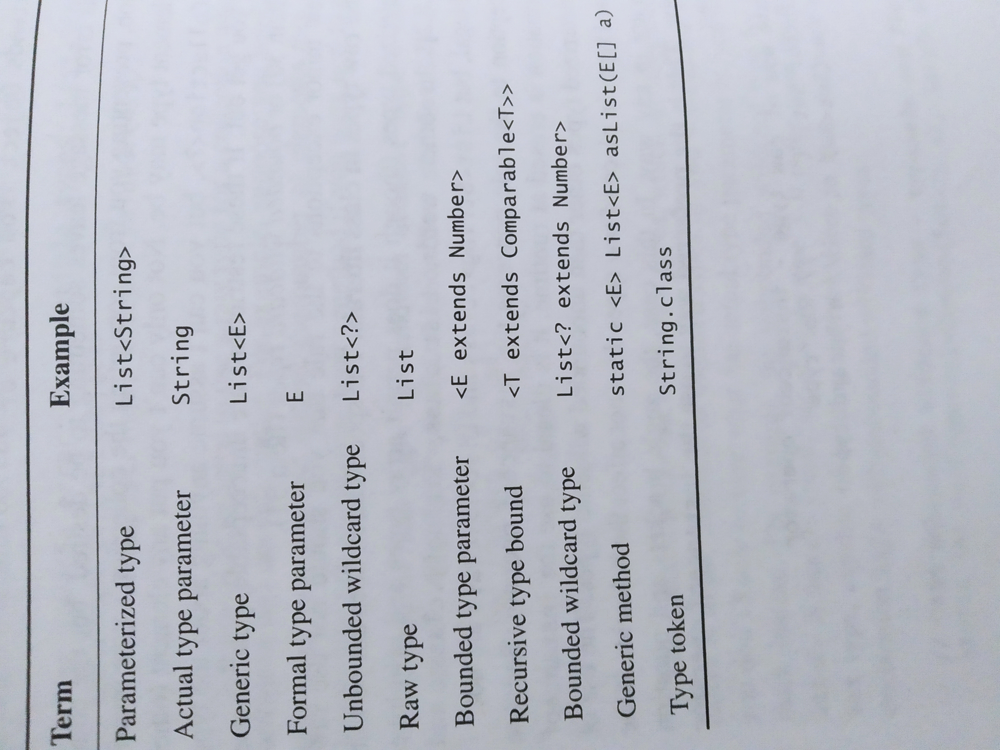

# Effective Java - 3rd Edition Notes


## Table of Contents
* [2 Creating and Destroying Objects](#2-creating-and-destroying-objects) 
    * [Item 1: Consider static factory methods instead of constructor](#item-1-consider-static-factory-methods-instead-of-constructors) 
    * [Item 2: Consider a builder when faced with many constructor parameters](#item-2-consider-a-builder-when-faced-with-many-constructor-parameters)   
* [3 Methods Common to All Objects](#3-methods-common-to-all-objects)   
    * [Item 10: Obey the general contract when overriding equals](#item-10-obey-the-general-contract-when-overriding-equals)  
    * [Item 11: Always override hashCode when you override equals](#item-11-always-override-hashcode-when-you-override-equals)  
    * [Item 12: Always override toString](#item-12-always-override-tostring)  
    * [Item 13: Override clone judiciously](#item-13-override-clone-judiciously)
    * [Item 14: Consider implementing Comparable](#item-14-consider-implementing-comparable)    
* [4 Classes and Interfaces](#4-classes-and-interfaces)   
    * [Item 15: Minimize the accessibility of classes and members](#item-15-minimize-the-accessibility-of-classes-and-members)  
    * [Item 16: In public classes, use accessor methods, not public fields](#item-16-in-public-classes-use-accessor-methods-not-public-fields)
    * [Item 17: Minimize mutability](#item-17-minimize-mutability)
    * [Item 18: Favor composition over inheritance](#item-18-favor-composition-over-inheritance)
    * [Item 19: Design and document for inheritance or else prohibit it](#item-19-design-and-document-for-inheritance-or-else-prohibit-it)
    * [Item 20: Prefer interfaces to abstract classes](#item-20-prefer-interfaces-to-abstract-classes)    
    * [Item 21: Design interfaces for posterity](#item-21-design-interfaces-for-posterity)    
    * [Item 22: Use interfaces only to define types](#item-22-use-interfaces-only-to-define-types)   
    * [Item 23: Prefer class hierarchies to tagged classes](#item-23-prefer-class-hierarchies-to-tagged-classes)    
    * [Item 24: Favor static member classes over nonstatic](#item-24-favor-static-member-classes-over-nonstatic)    
    * [Item 25: Limit source files to a single top-level class](#item-25-limit-source-files-to-a-single-top-level-class)    
* [5 Generics](#5-generics)   
    * [Item 26: Don't use raw type](#item-26-dont-use-raw-type)  
    * [Item 27: Eliminate unchecked warnings](#item-27-eliminate-unchecked-warnings)  
    * [Item 28: Prefer lists to arrays](#item-28-prefer-lists-to-arrays) 
    * [Item 29: Favor generic types](#item-29-favor-generic-types)
    * [Item 30: Favor generic methods](#item-30-favor-generic-methods)
    * [Item 31: Use bounded wildcards to increase api flexibility](#item-31-use-bounded-wildcards-to-increase-api-flexibility)
    * [Item 32: Combine generics and varargs judiciously](#item-32-combine-generics-and-varargs-judiciously)
    * [Item 33: Consider typesafe heterogeneous containers](#item-33-consider-typesafe-heterogeneous-container)
* [6 Enums and Annotations](#6-enums-and-annotations)   
    * [Item 34: Use Enums instead of int constants](#item-34-use-enums-instead-of-int-constants)  
    * [Item 35: Use instance fields instead of ordinals](#item-35-use-instance-fields-instead-of-ordinals)  
    * [Item 36: Use EnumSet instead of bit fields](#item-36-use-enumset-instead-of-bit-fields)  
    * [Item 37: Use EnumMap instead of ordinal indexing](#item-37-use-enummap-instead-of-ordinal-indexing) 
    * [Item 38: Emulate extensible enums with interfaces](#item-38-emulate-extensible-enums-with-interfaces) 
    * [Item 39: Prefer Annotations to naming pattern](#item-39-prefer-annotations-to-naming-patterns) 
    * [Item 40: Consistently use the Override annotation](#item-40-consistently-use-the-override-annotation) 
    * [Item 41: Use marker interfaces to define types](#item-41-use-marker-interfaces-to-define-types) 
* [7 Lambdas and Streams](#7-lambdas-and-streams)   
    * [Item 42: Prefer lambdas to anonymous classes](#item-42-prefer-lambdas-to-anonymous-classes)   
    * [Item 43: Prefer method references to lambdas](#item-43-prefer-method-references-to-lambdas) 
    * [Item 44: Favor the use of standard functional interfaces](#item-44-favor-the-use-of-standard-functional-interfaces) 
    * [Item 45: Use Stream Judiciously](#item-45-use-streams-judiciously)       
    * [Item 46: Prefer side-effect-free functions in streams](#item-46-prefer-side-effect-free-functions-in-streams)  
    * [Item 47: Prefer Collection to Stream as a return type](#item-47-prefer-collection-to-stream-as-a-return-type)    
    * [Item 48: Use caution when making streams parallel](#item-48-use-caution-when-making-streams-parallel)                                                                                                
* [8 Methods](#8-methods)   
    * [Item 49: Check parameters for validity](#item-49-check-parameters-for-validity)    
    * [Item 50: Make defensive copies when needed](#item-50-make-defensive-copies-when-needed)   
    * [Item 51: Design method signatures carefully](#item-51-design-method-signatures-carefully)   
    * [Item 52: Use overloading judiciously](#item-52-use-overloading-judiciously)   
    * [Item 53: Use varargs judiciously](#item-53-use-varargs-judiciously)   
    * [Item 54: Return empty collections or arrays, not nulls](#item-54-return-empty-collections-or-arrays-not-nulls)   
    * [Item 55: Return optionals judiciously](#item-55-return-optionals-judiciously)   
    * [Item 56: Write doc comments for all exposed api elements](#item-56-write-doc-comments-for-all-exposed-api-elements)
* [9 General Programming](#9-general-programming)    
    * [Item 57: Minimize the scope of local variables](#item-57-minimize-the-scope-of-local-variables)   
    * [Item 58: Prefer for-each loops to traditional for loops](#item-58-prefer-for-each-loops-to-traditional-for-loops)   
    * [Item 59: Know and use the libraries](#item-59-know-and-use-the-libraries)   
    * [Item 60: Avoid float and double if exact answers are required](#item-60-avoid-float-and-double-if-exact-answers-are-required)   
    * [Item 61: Prefer primitive types to boxed primitives](#item-61-prefer-primitive-types-to-boxed-primitives)   
    * [Item 62: Avoid strings where other types are more appropriate](#item-62-avoid-strings-where-other-types-are-more-appropriate)   
    * [Item 63: Beware the performance of string concatenation](#item-63-Beware-the-performance-of-string-concatenation)   
    * [Item 64: Refer to objects by their interfaces](#item-64-refer-to-objects-by-their-interfaces)   
    * [Item 65: Prefer interfaces to reflection](#item-65-prefer-interfaces-to-reflection)   
    * [Item 66: Use native methods judiciously](#item-66-use-native-methods-judiciously)   
    * [Item 67: Optimize judiciously](#item-67-optimize-judiciously)   
    * [Item 68: Adhere to generally accepted naming conventions](#item-68-adhere-to-generally-accepted-naming-conventions)   
* [10 Exceptions](#10-exceptions)    
    * [Item 69: Use exceptions only for exceptional conditions](#item-69-use-exceptions-only-for-exceptional-conditions)
    * [Item 70: Use checked exceptions for recoverable conditions and runtime exceptions for programming errors](#item-70-use-checked-exceptions-for-recoverable-conditions-and-runtime-exceptions-for-programming-errors)
    * [Item 71: Avoid unnecessary use of checked exceptions](#item-71-avoid-unnecessary-use-of-checked-exceptions)
    * [Item 72: Favor the use of standard exceptions](#item-72-favor-the-use-of-standard-exceptions)
    * [Item 73: Throw exceptions appropriate to the abstraction](#item-73-throw-exceptions-appropriate-to-the-abstraction)
    * [Item 74: Document all exceptions thrown by each method](#item-74-document-all-exceptions-thrown-by-each-method)
    * [Item 75: Include failure-capture information in detail messages](#item-75-include-failure-capture-information-in-detail-messages)
    * [Item 76: Strive for failure atomicity](#item-76-strive-for-failure-atomicity)
    * [Item 77: Don't ignore exceptions](#item-77-dont-ignore-exceptions)
* [11 Concurrency](#11-concurrency)   
    * [Item 78: Synchronize access to shared mutable data](#item-78-synchronize-access-to-shared-mutable-data)
    * [Item 79: Avoid excessive synchronization](#item-79-avoid-excessive-synchronization)
    * [Item 80: Prefer executors, tasks, and streams to threads](#item-80-prefer-executors-tasks-and-streams-to-threads)
    * [Item 81: Prefer concurrency utilities to wait and notify](#item-81-prefer-concurrency-utilities-to-wait-and-notify)
    * [Item 82: Document thread safety](#item-82-document-thread-safety)
    * [Item 83: Use lazy initialization judiciously](#item-83-use-lazy-initialization-judiciously)
    * [Item 84: Don't depend on the thread scheduler](#item-84-dont-depend-on-the-thread-scheduler)
* [12 Serialization](#12-serialization)   
    * [Item 85: Prefer alternatives to Java serialization](#item-85-prefer-alternatives-to-java-serialization)
    * [Item 86: Implement Serializable with great caution](#item-86-implement-serializable-with-great-caution)
    
## 2 Creating and Destroying Objects

### Item 1 Consider static factory methods instead of constructors
* the concept of static factory is just having a method to call the constructor internally instead of exposing the constructor publicly     
#### Advantage
* they have names and won't run into problems like multiple constructors cannot have the same signature
* they are not required to create a new object each time they're invoked
    * this open up great things like caching pre-constructed instances and control what instaces exist at any time
* they can return an object of any subtype of their return type  
    * [It means you can hide the implementatation details of choosing what object to create and return](https://stackoverflow.com/a/58719599/5777189) 
* the returned object can vary from call to call as a function of the input parameters
    * `EnumSet`'s static factory return a 64 less than items optimized `RegularEnumSet` back by a long, or `JumboEnumSet` backed by long array if > 64 items
* returned object need not exist when the class containing the method is written
    * [It means that the API of your static factory method can return an interface type, of which the implementation won't be written or generated until later](https://stackoverflow.com/a/53240824/5777189)    
* if you are extending a subclass, a normal constructor of the child class will force you to call `super()` as first line in the constructor before you got a chance to do any pre-processing of the data
    * public static factory allow you to call any other methods you need to manipulate the data before you pass that into the parent constructor
```java
public class Parent(){
    public Parent(ProccessedData proccessedData){ // parent need ProcessedData
    }
    public ProcessedData process(RawData rawData){
        //... internal logic
    }       
}
public class Child(){
   public Child(ProccessedData proccessedData){
      super(proccessedData);
   }
   public Child(RawData rawData){
      super(?????);  // normal constructor you are forced to pass the ProcessedData in this line
   }
    public Child of(RawData rawData){
        ProcessedData proccessedData = this.process(data); // give you a chance to process
        return new Child(proccessedData);
    }
}
```    
#### Disadvantage
* classes without public or protected constructors cannot be subclassed
    * could actually be a good thing to encourage other classes to use composition instead of inheritance ([Item 18](#item-18-favor-composition-over-inheritance))
* a little bit harder to find the public static factory method among the other normal methods
    * use conventional name like `from`, `of`, `valueOf`, `getInstance`, `list`, etc

### Item 2 Consider a builder when faced with many constructor parameters
* when you have many parameters going into a constructor, you could easily make a mistake of swaping some of them
#### Telescoping constructor pattern
* idea is make one constructor call the next constructor, setting the default value to the next parameter
```java
//example
public class NutritionFacts {
    private final int servingSize; // (mL) required
    private final int servings; // (per container) required
    private final int calories; // (per serving) optional
    private final int fat; // (g/serving) optional
    private final int sodium; // (mg/serving) optional
    private final int carbohydrate; // (g/serving) optional

    public NutritionFacts(int servingSize, int servings) {
        this(servingSize, servings, 0);
    }

    public NutritionFacts(int servingSize, int servings, int calories) {
        this(servingSize, servings, calories, 0);
    }

    public NutritionFacts(int servingSize, int servings, int calories, int fat) {
        this(servingSize, servings, calories, fat, 0);
    }

    public NutritionFacts(int servingSize, int servings, int calories, int fat, int sodium) {
        this(servingSize, servings, calories, fat, sodium, 0);
    }

    public NutritionFacts(int servingSize, int servings, int calories, int fat, int sodium, int carbohydrate) {
        this.servingSize = servingSize;
        this.servings = servings;
        this.calories = calories;
        this.fat = fat;
        this.sodium = sodium;
        this.carbohydrate = carbohydrate;
    }
}
```
* this pattern works, but it is hard to write client code when there are many parameters, and harder still to read it
* expect huge re-work when you update one of the parameter type, or add new parameters
* still forcing the client to deal with the problem of long sequences of identically typed parameters
    * for example client want to specify sodium, but want `calories` and `fat` to be default, client need to write `new NutritionFacts(240, 8, 0, 0, 35);`

#### JavaBeans pattern
```java
// JavaBeans Pattern - allows inconsistency, mandates mutability
public class NutritionFacts {
    // Parameters initialized to default values (if any)
    private int servingSize = -1; // Required; no default value
    private int servings = -1; // Required; no default value
    private int calories = 0;
    private int fat = 0;
    private int sodium = 0;
    private int carbohydrate = 0;
    public NutritionFacts() { }
    // Setters
    public void setServingSize(int val) { servingSize = val; }
    public void setServings(int val) { servings = val; }
    public void setCalories(int val) { calories = val; }
    public void setFat(int val) { fat = val; }
    public void setSodium(int val) { sodium = val; }
    public void setCarbohydrate(int val) { carbohydrate = val; }
}
```
use it as 
```java
NutritionFacts cocaCola = new NutritionFacts();
cocaCola.setServingSize(240);
cocaCola.setServings(8);
cocaCola.setCalories(100);
cocaCola.setSodium(35);
cocaCola.setCarbohydrate(27);
```
* this pattern has serious disadvantage
* because construction is split across multiple calls, a JavaBean may be in an inconsistent state partway through its construction
* the class cannot prevent an incompleted object from being used further
* automatically make a class mutable ([Item 17]((#item-17-minimize-mutability)))

#### Builder pattern
```java
// Builder Pattern
public class NutritionFacts {
    private final int servingSize;
    private final int servings;
    private final int calories;
    private final int fat;
    private final int sodium;
    private final int carbohydrate;

    public static class Builder {
        // Required parameters
        private final int servingSize;
        private final int servings;
        // Optional parameters - initialized to default values
        private int calories = 0;
        private int fat = 0;
        private int sodium = 0;
        private int carbohydrate = 0;

        public Builder(int servingSize, int servings) {
            this.servingSize = servingSize;
            this.servings = servings;
        }

        public Builder calories(int val) {
            calories = val;
            return this;
        }

        public Builder fat(int val) {
            fat = val;
            return this;
        }

        public Builder sodium(int val) {
            sodium = val;
            return this;
        }

        public Builder carbohydrate(int val) {
            carbohydrate = val;
            return this;
        }

        public NutritionFacts build() {
            return new NutritionFacts(this);
        }
    }

    private NutritionFacts(Builder builder) {
        servingSize = builder.servingSize;
        servings = builder.servings;
        calories = builder.calories;
        fat = builder.fat;
        sodium = builder.sodium;
        carbohydrate = builder.carbohydrate;
    }
}
```
* since the builder's setter methods return the builder itself so client can chain them like
```java
NutritionFacts cocaCola = new NutritionFacts.Builder(240, 8)
.calories(100).sodium(35).carbohydrate(27).build();
```
* client code with long sequences of identically typed parameters are not readable 
* the `NutritionFacts` class is immutable
* put all the parameter validity check in the builder's constructor and methods
* this pattern works well for class hierarchies (you can extend the parent's abstract builder)
* the same builder can be tweaked between invocations of the build method to create multiple objects
```java
// Builder pattern for class hierarchies
public abstract class Pizza {
    public enum Topping {HAM, MUSHROOM, ONION, PEPPER, SAUSAGE}

    final Set<Topping> toppings;

    abstract static class Builder<T extends Builder<T>> {
        EnumSet<Topping> toppings = EnumSet.noneOf(Topping.class);

        public T addTopping(Topping topping) {
            toppings.add(Objects.requireNonNull(topping));
            return self();
        }

        abstract Pizza build();

        // Subclasses must override this method to return "this"
        protected abstract T self();
    }

    Pizza(Builder<?> builder) {
        toppings = builder.toppings.clone(); // See Item 50
    }
}
```

```java
public class NyPizza extends Pizza {
    public enum Size {SMALL, MEDIUM, LARGE}

    private final Size size;

    public static class Builder extends Pizza.Builder<Builder> {
        private final Size size;

        public Builder(Size size) {
            this.size = Objects.requireNonNull(size);
        }

        @Override
        public NyPizza build() {
            return new NyPizza(this);
        }

        @Override
        protected Builder self() {
            return this;
        }
    }

    private NyPizza(Builder builder) {
        super(builder);
        size = builder.size;
    }
}
```
* the disadvantage of builder pattern is it requires client to create the builder object, could be a problem in performance-critical situations
## 3 Methods Common to All Objects

### Item 10 Obey the general contract when overriding equals

#### Only override equals if you need to
no override is needed if any of the condition apply:
* each instance of the class is inherently unique (classes such as Thread that represent entites rather than values)
* there is no need for the class to provide a "logical equality" test (`java.util.regex.Pattern` class do not expect any user to be checking regular expression)
* a superclass has already overridden equals, and the superclass behavior is appropriate for this class (equals from `AbstractSet`, `AbstractList`, `AbstractMap`)
* the class is private or package-private and you are certain that its equals method will never be invoked
```java
 // you can ensure that it isn't invoked accidentally
 @Override
 public boolean equals(Object o) {
     throw new AssertionError(); // Method is never called
 }
``` 
#### If you override the equals method, here is the contract
* Reflexive: For any non-null reference value x, x.equals(x) must return true
* Symmetric: For any non-null reference values x and y, x.equals(y) must return true if and only if y.equals(x) returns true
* Transitive: For any non-null reference values x, y, z, if x.equals(y) returns true and y.equals(z) returns true, then x.equals(z) must return true
* Consistent: For any non-null reference values x and y, multiple invocations of x.equals(y) must consistently return true or consistently return false, provided no information used in equals comparisons is modified
* For any non-null reference value x, x.equals(null) must return false.

#### Symmetric
* symmetric can be broken when you compare a class with its subclass  

The example given in the book is `CaseInsensitiveString`, while CaseInsensitiveString knows about ordinary strings, strings doesn't know about CaseInsensitiveString
```java
CaseInsensitiveString cis = new CaseInsensitiveString("Polish");
String s = "polish";
```
* while `cis.equals(s)` returns true,  `s.equals(cis)` returns false.   
* The problem is if you have a `List<CaseInsensitiveString>`, and you do `list.contains("string")` no one knows what will happen

#### Transitivity
* transitivity can also be broken when you compare a class with its subclass   
The example given in the book is `Point` and `ColorPoint` (colorPoint extends Point)   
Happen when you make `ColorPoint`'s equals() flexible and compare only x,y when you see a point, and compare x,y and color when you see a `ColorPoint`  
```java
ColorPoint p1 = new ColorPoint(1, 2, Color.RED);
Point p2 = new Point(1, 2);
ColorPoint p3 = new ColorPoint(1, 2, Color.BLUE);
```
* now p1 equals p2, p2 equals p3, but p1 does not equals p3
* **this is a fundamental problem of equivalence relations in object-oriented languages, there is no solution** 
* it is still justified to compare the subclass, `ColorPoint` still need to be able to behavior like a `Point`, especially if we plan to put `ColorPoint` into a collection of `Point`

#### Consistency
* if two objects are equal, they must remain equal for all time unless one of them is modified
* think about if the object can be immutable
* do not write an equals method that depends on unreliable resources

#### Non-nullity
* there is no need to do a null check specifically, the `instanceOf` returns false if object is null
```java
@Override
public boolean equals(Object o) {
    if (!(o instanceof MyType))
        return false;
    MyType mt = (MyType) o;
    ...
}
```

#### Steps to implement equals()
1. use the == operator to check if the argument is a reference to this object
2. use `instanceof` to check if the argument has the correct type
3. cast the argument to the correct type
4. For each “significant” field in the class, check if that field of the argument matches the corresponding field of this object. If all these tests succeed, return true; otherwise, return false

#### field comparision
* for primitive fields whose type is not float or double, use the == operator for comparisons
* for object reference fields, call the equals method recursively
* for float fields, use the static `Float.compare(float,float)` method
* for double fields, use `Double.compare(double, double)`
* the special treatment of float and double fields is made necessary by the existence of Float.NaN, -0.0f and the analogous double values
* `Float.equals` and `Double.equals` would do autoboxing for every comparision and have poor performance
* for array, use `Arrays.equals`
* to improve performance, first compare the fields that are more likely to differ, or less expensive to compare
* or compare derived fields, for example if the area of `Polygon` is different then there is no need to check the edges and vertices
* lastly remember the parameter of `equals()` is `object`, otherwise you are overloading not overriding (Item 40)


### Item 11 Always override hashCode when you override equals
* hashcode is crucial for object to function properly in collections such as Hashmap and HashSet

#### HashCode Contract
* consistency: when the hashCode method is invoked on an object repeatedly and nothing in equals is changed, it must consistently return the same value
* if two objects are equal according to the equals method, then hashCode on the two objects must be the same
* if two objects are unequal according to the equals method, it is **not** a requirement for hashCode to be different (but a good hash function tends to produce unequal hashcodes for unequal instances)

---
* a poor hashCode that always return the same number for every instance will hash everything to the same bucket, reduce performance to to linear time instead of quadratic time
* we usually multiple by an odd prime number to a signficant field to produce the hashcode (see book page 51)
* you can also use `Objects.hash()` method that takes an arbitrary number of objects and compute the hashcode for you, downside is it runs more slowly
* can also consider storing or lazily initialize the hashcode during object creation if it is expensive to calculate
* do not exclude significant fields from the hash code computation to improve performance; if there are large collection of instances who differ only at the regions you've chosen to ignore, the performance suffer
* don't provide detailed specification for the value returned by hashCode, so clients can't reasonably depend on it; this gives you the flexibility to change it

### Item 12 Always override toString
* the default `Object.toString()` print the unsigned hexadecimal representation of the hash code, which isn't too useful
* toString method is automatically invoked when an object is passed to println, printf, the string concatenation operator, or assert, or is printed by debugger
* the benefit of a informative toString method extend beyond instances of the class to objects containing references to these instances, especially in collections
* when practical, the toString method should return all of the interesting information contained in the object
```java
// you don't ever wanna see this:
// Assertion failure: expected {abc, 123}, but was {abc, 123}.
```
#### think about whether to specify the format of the return value in the documentation
* if you do, it can serves as a standard format to use in parsing the object into some CSV for example
* also provide corresponding matching factory or from string constructor for user to easily translate between the object and its string representation
* disadvantage is once you specified a format, it is hard to make change in future if many client code depend on it
* if you don't specify a format, you preserve the flexibility to add information or improve the format in later release
---
* always provide programmatic access to the information contained in the value returned by toString: provide accessor method instead of forcing your user to parse your toString
* it makes no sense to write toString method in a static utility class, for enum types the default one is perfectly good
* you should write a toString method in any abstract class whose subclasses share a common string representation (most collection classes work like this)

### Item 13 Override clone judiciously
* `java.lang.Object`'s `clone()` method is awful, a better approach to object copying is to provide a copy constructor or copy factory

#### How Object.clone() work
* `Object.clone()` will return you a **shallow copy** of the object, the cloning logic is implemented in native code
* it throws checked exception `CloneNotSupportedException` if an object does not implements `Cloneable`
* it is implement as a protected method, meaning if you have a `Dog` class and if it doesn't override `clone`, you cannot call `clone` on it
* to get the `Object.clone()` to clone your `Dog` class, `Dog` class and all its parents all the way up to `Object` needs to call `super.clone()`
#### Problem with Object.clone()
* `Cloneable` is a marker interface (bad design), it contains no method
* this means a class implementing `Cloneable` is not forced to override `Object.clone()` or override it but do not call `super.clone()` and break the chain
* rely on constructor chaining, except that it isn't enforced; compiler won't complain if a class doesn't call `super.clone()`
* the call to `super.clone()` must be contained in a try-catch block because `CloneNotSupportedException`
* we must cast the result of `super.clone()` back to the class's type, but this cast is guarantee to succeed
* it clones shallow copy so if modifying the field in the cloned object modify the original
* we can call `clone` on arrays to ensure each element is clone recursively (a good use case for clone is array)
```java
// Clone method for class with references to mutable state
@Override
public Stack clone() {
    try {
        Stack result = (Stack) super.clone();
        result.elements = elements.clone(); // element is an array
        return result;
    } catch (CloneNotSupportedException e) {
        throw new AssertionError();
    }
}
```
* notice if a mutable object field is final, then we cannot use the clone recursively strategy and re-assign value
* for more complexe object, like an array of linked item (HashTable), need to do more complicated deepCopy logic (see p63 example)

#### Watch out
* immutable classes should never provide a clone method because you could just reuse that single instance everywhere
* if a final class has a clone method that does not invoke super.clone, there is no reason for the class to implement `Cloneable`, as it doesn't rely on the behavior of Object's clone implementation
* like a constructor, a clone method must never invoke an overridable method (Item 19 bullet point 4)
* public clone methods should omit the throws clause (sallow the `CloneNotSupportedException` so caller is easier to use)
* to design a class for inheritance, there are 2 choices but both **should not** implement `Cloneable`
    * a properly functioning protected clone method that is declared to throw CloneNotSupportedException. This gives subclasses the freedom to implement Cloneable or not, just as if they extended Object directly
    * not to implement a working clone method, and to prevent subclasses from implementing one
    ```java
    // clone method for extendable class not supporting Cloneable
    @Override
    protected final Object clone() throws CloneNotSupportedException {
        throw new CloneNotSupportedException();
    }
    ```
* again, object copying is to provide a copy constructor or copy factory are better because they can take interface type instead
    * like transform a `HashSet` into a `TreeSet` with `new TreeSet<>(s)` where s is `HashSet`

### Item 14 Consider implementing Comparable
* by implementing `Comparable`, a class indicates that its instances have a natural ordering
* the `compareTo` method is not declared in Object but rather it is the sole method in `Comparable`
#### here is the contract
* compare this object (a) with another argument object (b), return negative if a go before b, 0 if order doesn't mater, postive if a go after b
* throws `ClassCastException` if the specified object's type prevents it from being compared to this object

* Symmetric: a.compareTo(b) and b.compareTo(a) needs to be reverse of each other
* Transitive: if a.compareTo(b) > 0 and b.compareTo(c) > 0, then a.compareTo(c) must > 0
* it is strongly recommended, but not required, that (x.compareTo(y)== 0) == (x.equals(y)) 
    * Generally speaking, any class that implements the Comparable interface and violates this condition should clearly indicate this fact
    * The recommended language is “Note: This class has a natural ordering that is inconsistent with equals.”
    * problem such as two `new BigDecimal("1.0")` and `new BigDecimal("1.00")` put into a HashSet is 2 items, but put into a TreeSet is only 1 element

#### watch out
* the same caveat from `Object.equals()` applies, there is no way to extend a `Comparable` class and still preseving the compareTo contract
* since `Comparable` is parameterized, the if the argument to `compareTo` is wrong type, it won't compile
* use the static compare methods for all Java's boxed primitive classes comparison
* use of the relational operators < and > in compareTo methods is verbose and error-prone and no longer recommended
* the `Comparator` interface also as a set of construction methods, they are slower but more concise
```java
// Comparable with comparator construction methods
private static final Comparator<PhoneNumber> COMPARATOR = comparingInt((PhoneNumber pn) -> pn.areaCode)
    .thenComparingInt(pn -> pn.prefix)
    .thenComparingInt(pn -> pn.lineNum);

public int compareTo(PhoneNumber pn) {
    return COMPARATOR.compare(this, pn);
}
```
* there are also comparator construction methods for object reference types named `comparing`, read p71 for its overloads
* using `a-b` in the compareTo method is subjected to integer overflow, use either a static compare method or comparator construction method

## 4 Classes and Interfaces

### Item 15 Minimize the accessibility of classes and members
* encapsulation is to hide a component's implementation details from other components
    * decouples the components from a system to be developed, tested in isolation
    * increase software reuse
* make each class or member as inaccessible as possible
* for top-level (non-nested) classes and interfaces, there are only package-private (default) and public access levels
* if a top-level class can be made package-private, it should be
    * by making this class part of the package's implementation rather than an exported API, we can modify, replace, or remove without worry about compatibility
* if a top-level class is only used by one class, consider making the top-level class a private static nested class of the class using it
* the four possible access levels:
    * private
    * package-private (default)
    * protected
    * public
* a protected member is part of the class's exported API and must be supported forever
* both private and package-private members are part of a class's implementation and do not normally exported as API
    * but they can be leak if the class implements Serializable
* if a method overrides a superclass method, it cannot have a more restrictive access level in the subclass than in the superclass
* all methods from an interface must be declared public
* it is acceptable to make a private member of a public class package-private in order to test it, but not acceptable to raise the accessibility any higher
* instance fields of a public class should rarely be public
    * give up the ability to take any action when the field is modified
    * not thread-safe
    * even if the field is final and refers to an immutable object, making it public means you give up the flexibility to switch to a new internal data represtation in which the field doesn't exist
    * while the reference cannot be modified, the referenced object can still be modified
* nonzero-length array is always mutable, so it is wrong for a class to have a public static final array field, or an accessor that reutns it
```java
// Potential security hole!
public static final Thing[] VALUES = { ... };
// fix: either store into a public immutable list
private static final Thing[] PRIVATE_VALUES = { ... };
public static final List<Thing> VALUES = Collections.unmodifiableList(Arrays.asList(PRIVATE_VALUES));
// or clone a copy of the array
private static final Thing[] PRIVATE_VALUES = { ... };
public static final Thing[] values() {
    return PRIVATE_VALUES.clone();
}
```    
### Item 16 In public classes, use accessor methods, not public fields
* often we have classes that serve no purpose other than to group instance fields
```java
class Point {
  public double x;
  public double y;
}
```
* because the data fields are public, you cannot change the fields without changing the code using it
* if these kind of classes are package private or private nested class, there is nothing wrong with exposing its data fields
    * less clutter without the getter setter methods
    * any changes to this class is confined to the package
* for public classes, it is never a good idea to expose the fields publicly
   
### Item 17 Minimize mutability
* immutable class is simply a class whose instances cannot be modified, and all information in each instance is fixed for the lifetime of that object
#### immutable objects' benefit:
* they are simple; the class property (invariant) during object creation will always be maintained
* they are thread-safe; require no synchronization (easiest approach to achieve thread safety)
* they can be shared freely, encourage clients to reuse existing instances wherever possible
```java
 // constant objects can just be reuse
  public static final Complex ZERO = new Complex(0, 0);
  public static final Complex ONE = new Complex(1, 0);
  public static final Complex I = new Complex(0, 1);
```
* since immutable objects can be shared freely, we never have to make defensive copies because the copies would be forever equivalent to the originals
* therefore, we need not or should not provide a clone method or copy constructor on an immutable class
* we can also share immutable object's internal to another immutable object (for example, `BigInteger` negate() method)
* they are great map keys and set elements because we don't have to worry about their values changing and changed their hashcode invariants
#### disadvantage  
* require a separate object for each distant value
* for example to update a bit in the `BigInteger`, this operation requires time and space proportional to the size of the `BigInteger`
* the performance problem is magnified if you perform a multistep operation that generates a new object at every step, and only keep the final result object
* there are solutions to this:
    * provide primitive instead of immutable object for the common multistep operations
    * provide a package-private or public mutable companion class (example: StringBuilder for String)
#### rules to make a class immutable:
* 1. Don't provide methods that modify the object's state (known as mutators)
    * this is stronger than necessary; some immutable classes have nonfinal fields in which they cache the results of expensive computations
* 2. Ensure that the class can't be extended
    * make the class final or make the constructors private or package-private and use public static factories
    * this allow the class to still be subclass-able in the pckage but un-extendable for classes outside of the package
* 3. Make all fields final
* 4. Make all fields private
* 5. Ensure exclusive access to any mutable component
    * do not just expose the mutable fields' reference to clients
    * do not initialize such field from client-provided object
    * make defensive copies in constructors, accessors, and readObject methods for serializable   
* classes should be immutable unless there's a very good reason to make them mutable; limit its mutability as much as possible
* declare every field private final unless there's a good reason not to
* constructors should create fully initialized objects with all of their invariants established    

### Item 18 Favor composition over inheritance
* inheritance violates encapsulation ([61B example](https://www.youtube.com/watch?v=EfxYiAN6YME&list=PL8FaHk7qbOD6Mi8gDriGGeSnHi68QLuVD&index=6))
* a class can have method that invoke another method in the same class. If you extend this class and override one of the method, now the parent class will be invoking the method you override instead
#### Problem
* this means a subclass depends on the implementation details of its superclass for its proper function
* adjusting to the superclass to make the subclass work would depend on the superclass's implementation details, and that is subject to change from release to release
* reimplementing superclass methods is difficult, time-consuming, error-prone, and may reduce performance
* not always possible because some methods cannot be implemented without access to private fields inaccessible to the subclass
* if you override every method from superclass to ensure some condition to be true, this works until a new method is added to the superclass that break your condition
* extending a class merely to add new method (no overriding any method) is much safer, but nothing prevent the superclass to add a new method with the same name of your method (now you overriding again)
* if there are any flaws in the superclass, extending it propagates these flaws in the system, where composition can hide them
#### Solution
* The solution to all of above is to give your new class a private field that references the class you plan to extend (call composition)
* have a forwarding class that hold the class you plan to extend, with methods to interface with that class. A separate class extends the forwarding class with your desired functionality (see example page 90)
* composition is flexible in that it can holds a interface as private field, where inheritance can only extend one concrete class
* the drawback of composition is it is not suited for callback, performance is usually not an issue
* prevent class from outside your package to extend your class, a malicious client can corrupt the invariants of the superclass
* a class B should extend a class A only if there is an "is-a" relationship between the two classes


### Item 19 Design and document for inheritance or else prohibit it
* for a class to support inheritance:
    * for each public or protected method, the documentation must indicate which overridable methods the method invokes
    * this is an unfortunate consequence that this kind of documentation will violate the good pratice of describing what a given method does and now how it does it, 
* the only way to test a class designed for inheritance is to write subclasses and see what methods are used or not used
* when you design for inheritance a class that is likely to achieve wide use, realize that you are committing forever to the self-use patterns that you documented
* constructors must not invoke overridable methods, directly or indirectly
    * superclass constructor runs before the subclass constructor, so the overrided method in the subclass will get invoked before the subclass constructor has run
    * this usually throw a `NullPointerException`
    * it is safe to invoke private methods, final methods, and static methods as none of them are overridable
    * you can also move the body of the overridable method to a private helper method and call that method instead; the overridable method can also call that helper method   
* `Cloneable` and `Serializable` in a class behavior like constructors, so neither clone nor readObject may invoke an overridable method, directly or indirectly
    * in the case of `readObject`, the overriding method will run before the subclass's state has been deserialized
    * in the case of `clone`, the overriding method will run before the subclass's clone method has a chance to fix the clone's state
* prohibit subclassing in classes that are not designed and documented to be safely subclassed
    * either declare the class final
    * or make all constructors private or package-private and to use public static factories; this allow the class to still be subclass-able within the package
    * don't feel bad about prohibiting subclassing, the composition strategy from previous item is better approach
* if you have access to everything in a project and you can change anything at any time (you are not shipping public releases), then this item doesn't matter too much

### Item 20 Prefer interfaces to abstract classes
* you can only extend one class, but you can implement as many interface as you like in Java
* an existing class can easily be retrofitted to implement a new interface, but not extend more classes
* interface do not force you to put a class on top of another class in the type hierarchies
* inheritance also subject you to break encapsulation
#### Interface limitation
* cannot provide default methods for Object methods such as [equals and hashCode](https://stackoverflow.com/q/24016962/5777189)
* cannot contain instance fields or nonpublic static members
#### Abstract skeletal implementation
* we can combine the advantages of interfaces and abstract classes 
* have an interface to define the type and providing some default methods, and the skeletal implementation class will implement the interface and provide interface methods
* now you can extend this skeletal implementation class instead
#### benefit
* you can still use the interface as type
* it is optional to extend this skeletal implementation class, other classes can still implement the interface directly if they prefer
* the skeletal implementation class can provide default methods for Object methods such as equals and hashCode
* you can create an abstract version or a simple version; a simple implementation is the simplest possible working implemenation that you can use as it or subclass to customize
* skeletal implementation class also need to design and document for inheritance

### Item 21 Design interfaces for posterity
* when you add a new method to an interface, any existing implementation would break because now they don't have implementation for the new method
* default methods in interfaces evolve an interface without requiring the consumer of the service to implement that method right away
* default methods can violate constraints (invariants) of some classes
    * for example Apache's `synchronizedCollection` is no longer synchronized if a client directly call the `removeIf()` method from Collection interface
* in the presence of default methods, existing implementations of an interface may compile without error or warning but fail at runtime
* using default methods to add new methods to existing interfaces should be avoided unless the need is critical, in which case think if any existing interface implementations might break

### Item 22 Use interfaces only to define types
* use interface to serves as a type so a user can refer to a class by the interface type
* do not use interface to group constants like below
```java
// Constant interface antipattern - do not use!
public interface PhysicalConstants {
    // Avogadro's number (1/mol)
    static final double AVOGADROS_NUMBER = 6.022_140_857e23;

    // Boltzmann constant (J/K)
    static final double BOLTZMANN_CONSTANT = 1.380_648_52e-23;

    // Mass of the electron (kg)
    static final double ELECTRON_MASS = 9.109_383_56e-31;
}
```
#### Problem
* the constants used by a class are implementation details and should be be leak into the class's exported API
* this interface type is no use to any user and confuse them
* it represents a commitment and removing this interface in the future might break existing implementation
#### Solution
* if these constants are specific to the class, just make them member field, like `Integer.MAX_VALUE`
* export these constants in a enum 
* use a normal noninstantiable utility class

### Item 23 Prefer class hierarchies to tagged classes
* do not write classes that use a field to tag which kind of flavor or type this instance is
* for example below is a class to support both RECTANGLE and CIRCLE
```java
// Tagged class - vastly inferior to a class hierarchy!
class Figure {
    enum Shape {RECTANGLE, CIRCLE};

    // Tag field - the shape of this figure
    final Shape shape;

    // These fields are used only if shape is RECTANGLE
    double length;

    double width;

    // This field is used only if shape is CIRCLE
    double radius;

    // Constructor for circle
    Figure(double radius) {
        shape = Shape.CIRCLE;
        this.radius = radius;
    }

    // Constructor for rectangle
    Figure(double length, double width) {
        shape = Shape.RECTANGLE;
        this.length = length;
        this.width = width;
    }

    double area() {
        switch (shape) {
            case RECTANGLE:
                return length * width;
            case CIRCLE:
                return Math.PI * (radius * radius);
            default:
                throw new AssertionError(shape);
        }
    }
}
```
#### Problem
* cluttered with enum declarations, tag fields, switch statements, and fields that are meaningless to other types
* readability is harmed because jumbled multiple implementations into a single class
* memory footprint increased because instances are burdened with irrelevant fields belonging to other types
* constructors must set the tag field and initialize the right data fields with no help from the compiler
* if you want to support a new type, you need to update all the switch statement and type check logic
* if you want to support a new type, you must have come back to edit this class, where as inheritance you can inherit an existing subclass
#### Solution
* break a tagged class into proper class hierarchy with abstract class and concrete subclass for each type

### Item 24 Favor static member classes over nonstatic
* There are four kinds of nested class in Java. 
    * **static member classes**: declared as a static member of another class
    * **nonstatic member classes**: declared as an instance member of another class
    * **local classes**: declared inside an instance method of another class
    * **anonymous classes**: like a local inner class, but written as an expression which returns a one-off object
* if you make a static nested class nonstatic instead, each instance will have a hidden extraneous reference to its enclosing instance
* this extraneous reference to time and space to store and can cause hard to detect memory leak
* a quick rule is if you declare a member class that does not require access to the enclosing instance, always make it static
* to understand the difference, I always come back to [this post](https://stackoverflow.com/a/70687/5777189)


### Item 25 Limit source files to a single top-level class
* there is no benefits to defining multiple top-level classes in a single source file
* this just increase the risk of you accidentally make another source file and declare another class with the same name
* what will happen is unpredictable behavior (might fail to compile, work as before, or use your new class), depends on the command you use and compiler etc
* fix the problem by splitting the top-level classes into separate source files with names match the top-level class name
* or make nested class

## 5 Generics

### Item 26 Don't use raw type
* raw types are generic types without their type parameters
* Java still allow raw type only for the compatibility with legacy code written before generic was introduced
* if you use raw types, you lose the safety and expressiveness benefits of generics (compiler won't let you put the wrong type of object into a collection)
* it is fine to use `List<Object>` to allow insertion of arbitrary objects
* to demonstrate the different between raw type `List` and `List<Object>`
    * raw type opted out of the generic type system for compiler to check
    * below code compile successfully, but throw `ClassCastException` at runtime
    * if we change the argument `List` to `List<Object>`, the compiler will prevent `List<String>` from passing to the method
    * this mean, we lose type safety if we use a raw type such as List, but not if we use a parameterized type such as `List<Object>`
```java

public static void main(String[] args) {
    List<String> strings = new ArrayList<>();
    unsafeAdd(strings, Integer.valueOf(42));
    String s = strings.get(0); // Has compiler-generated cast
}

private static void unsafeAdd(List list, Object o) {
    list.add(o);
}
```

* if you want to use a generic type but you don't know or care what the actual type parameter is, use the `?` (unbounded wilcard types)
* there are exceptions to when we should use raw type:
    * class literals such as `List.class`, `String[].class`, and `int.class` but not `List<String>.class` nor `List<?>class`
    * `instanceof` operator because generic type information is erased at runtime
```java
// Legitimate use of raw type - instanceof operator
if (o instanceof Set) { // Raw type
    Set<?> s = (Set<?>) o; // Wildcard type
    ...
}
```    


### Item 27 Eliminate unchecked warnings
* if you can't eliminate a warning, but you can prove that the code that provoked the warning is typesafe, then (only then) suppress the warning with an `@SuppressWarnings("unchecked")` annotation
* always use the `@SuppressWarnings` at the smallest scope possible
* always add a comment explaining why it is safe to `@SuppressWarnings` 

### Item 28 Prefer lists to arrays
* **Generics are implemented by erasure. Meaning they enforce their type constraints only at compile time and discard (erase) their element type information at runtime**
* arrays know and enforce their element type at runtime (less ideal than finding problem at compile)  
```java
// Example:
// Fails at runtime!
Object[] objectArray = new Long[1];
objectArray[0] = "I don't fit in"; // Throws ArrayStoreException

// Won't compile!
List<Object> ol = new ArrayList<Long>(); // Incompatible types
ol.add("I don't fit in");
```
* it is illegal to create an array of a generic type: none of these are legal: `new List<E>[]`, `new List<String>[]`, `new E[]`
    * the reason is generic type constraint is erased during runtime, when mixing in array, you could add incorrect type into that array (defeat generic purpose)
    * note that you can still declare a `E[]`, but you cannot do `new E[]`
* when you get a generic array creationg error or unchecked cast warning on a cast to an array type, the best solution is to use `List<E>` instead of array `E[]`; sacrifice some performance in exchange of type safety    
```java
//https://stackoverflow.com/a/16381390/5777189
// When you declare:
  
  public static <T> void foo(List<T>... bar) // the compiler converts it to
  
  public static <T> void foo(List<T>[] bar)// then to
  
  public static void foo(List[] bar) 
  // because erasure, the generic type information is loss at run time;
  // this open up a can of worms when used with varargs, because now you can add invalid type into this List[] (more on Item 32)
```

  
### Item 29 Favor generic types
* this chapter shows that if you don't use generic you gonna need to do some cast
```java
E[] elements = (E[]) new Object[DEFAULT_INITIAL_CAPACITY];
//or leave elements as Object[] and do the cast when you access the object
```
* type parameters have no restrictions: you can create a Stack, Stack<int[]>, Stack<List>, or Stack of any other object reference type
* cannot create a generic of a primitive type. You can work around this restriction by using boxed primitive types

### Item 30 Favor generic methods
* here is an example of a basic generic method
```java
// Generic method
public static <E> Set<E> union(Set<E> s1, Set<E> s2) {
```
* use recursive type bound for expression involving that type parameter itself, an example is a type want to compare only with elements of the same type
```java
public interface Comparable<T> {
    int compareTo(T o);
}

public static <E extends Comparable<E>> E max(Collection<E> c);
```

### Item 31 Use bounded wildcards to increase API flexibility
```java
Stack<Number> numberStack = new Stack<>();
Iterable<Integer> integers = ... ;
numberStack.pushAll(integers);
// if you have a list of Integer and you should be able to put it in a stack of Number, since Integer extends Number
```
* the above won't work because `List<Integer>` is not a subtype of `List<Number>`, call invariant
* the solution is bounded wildcards
```java
// Wildcard type for a parameter that serves as an E producer
public void pushAll(Iterable<? extends E> src) {
    for (E e : src)
        push(e);
}
// Wildcard type for parameter that serves as an E consumer
public void popAll(Collection<? super E> dst) {
  while (!isEmpty())
    dst.add(pop());
}
```
* since src **produce** the E, it extends; since dst **consume** the E, it super
* the reasoning is to be flexible; for pushAll(), as long as the element in src is a subtype of E, we can put that element into a list of E; for popAll(), since we want store as much type of E into dst as possible, we make dst a parent of all type of E
* do not use bounded wildcard types as return types, force them to use wilcard types in client code; the user of this method should not need to think about the wildcard types
*  Comparables and Comparable are always consumers, so you should generally use Comparable<? super T> in preference to Comparable<T>
```java
public static <T extends Comparable<? super T>> T max(List<? extends T> list)
```
* there is also unbounded wildcard `List<?>` (Extreme rare usecase, [benefit](https://stackoverflow.com/q/7671072/5777189))
    * it is better for public API because you can pass in a list-any list, and there is no type parameter to worry about
```java
// Two possible declarations for the swap method
public static <E> void swap(List<E> list, int i, int j);
public static void swap(List<?> list, int i, int j);
```
* The problem is that the type of list is List<?>, and you can’t put any value except null into a List<?>
* also cannot add element into the list anymore, need to use a simple helper method (see book)

### Item 32 Combine generics and varargs judiciously
* with generic, you cannot do this:
```java
        List<Object> c = new ArrayList<>();
        List<String> d = c;
```
* but with array, you can do this:
```java
        String[] a = new String[]{"wtf", "wtf2"};
        Object[] b = a;
```
* recall that we invoke a varargs method, an array is created to hold the varargs parameters
* if we have varargs of generic, we can cause Heap pollution
```java
// Mixing generics and varargs can violate type safety!
static void dangerous(List<String>... stringLists) {
    List<Integer> intList = List.of(42);
    Object[] objects = stringLists;
    objects[0] = intList; // Heap pollution
    String s = stringLists[0].get(0); // ClassCastException
}
```
* this demonstrate it is unsafe to store a value in a generic varargs array parameter
* it is legal to declare a method with a generic varargs parameter but illegal to create a generic array explicitly
* if a method with varargs parameters is invoked, you will get a [warning](https://stackoverflow.com/q/12462079/5777189)
    * this force users of this method to do `@SuppressWarnings("unchecked")` at every call site
    * after Java 7, you can add a `@SafeVarargs` to remove the warning
    * adding this annotation means you can prove this method is typesafe
    * a varargs parameters method is typesafe if:
        * the method doesn't store anything into the array
        * **doesn't give another method access to a generic varargs parameter array**
* example of why passing the reference to the array make it unsafe        
```java
// UNSAFE - Exposes a reference to its generic parameter array!
static <T> T[] toArray(T... args) {
  return args;
}
static <T> T[] pickTwo(T a, T b, T c) {
  switch(ThreadLocalRandom.current().nextInt(3)) {
    case 0: return toArray(a, b);
    case 1: return toArray(a, c);
    case 2: return toArray(b, c);
  }
  throw new AssertionError(); // Can't get here
}
public static void main(String[] args) {
  String[] attributes = pickTwo("Good", "Fast", "Cheap");  //  ClassCastException, because Object[] is not a subtype of String[].
}
```
* `T...` allocates an array of type Object[], which is the most specific type that is guaranteed to hold these instances, no matter what types of objects are passed to pickTwo at the call site
* or you can always just use `List<List<? extends T>> lists` instead of varargs in the parameter
* always use `@SafeVarargs` on every method with a generic varargs parameter, so its users won't be burdened by confusing compiler warnings

### Item 33 Consider typesafe heterogeneous container
* usually you can one put a single type of parameter into a container, like you can only put String into `List<String>`
* but if you need to support putting an unknown number of types into a container, you can use this approach:
```java
// Typesafe heterogeneous container pattern - implementation
public class Favorites {
  private Map<Class<?>, Object> favorites = new HashMap<>();

  public <T> void putFavorite(Class<T> type, T instance) {
    favorites.put(Objects.requireNonNull(type), instance);
  }

  public <T> T getFavorite(Class<T> type) {
    return type.cast(favorites.get(type));
  }
}
```
* a legitimate use case is you want a container class for arbitrarily many columns of a database row
* notice in the put method the parameter is not simply `Class` but `Class<T>`, this class literal is call a type token
* it is typesafe: it will never return an Integer when you ask it for a String
* it is also heterogeneous: unlike an ordinary map, all the keys are of different types
* there are 2 limitations to this approach:
    * a malicious client could corrupt the type safety by passing in a raw Class object
    * but this could be easily fix by adding a dynamic cast in the put method
```java
// Achieving runtime type safety with a dynamic cast
public <T> void putFavorite(Class<T> type, T instance) {
    favorites.put(type, type.cast(instance));
}
```
* second limitation: it canot be used on non-refitiable type such as `List<String>`
    * `List<String>.class` is a syntax error
    * `List<String>` and `List<Integer>` are both `List.class`. 
    * if `List<String>.class` and `List<Integer>.class` were legal and returned the same object reference it would be bad
* you can limit the types that can be passed to this container by using bounded type token
* there is a useful method from `Class` call `asSubclass` that let you cast a `Class<?>` into `Class<? extends Annotation>`, no compiler warning 

## 6 Enums and Annotations

### Item 34 Use Enums instead of int constants
* Before enum was added to Java, a common pattern for representing a finite group of constants was to declare `final int`
```java
// The  int enum pattern
public static final int APPLE_FUJI = 0;
public static final int ORANGE_NAVEL = 0;
```
* It has a list of shortcomings:
    * compiler won't alert you, if you pass an apple to a method that expects an orange (they are both `int`)
    * if the value of an int enum is changed, the clients must recompiled or it will still run with incorrect behavior
    * printing the `int` is not meaningful
    * no reliable way to iterate over all the `int` enum
    * can't optain the size of `int` enum group
* There is also the String enum pattern
    * lead to clients hard coding the string constants instead of using the field name
    * easy typo that can't be check by compiler
    * performance drop with the string comparision    
* enum solves all of the above with: 
    * you can add or reorder constants in an enum without recompiling its clients
    * customize printable strings by overriding the `toString` method
    * if we remove a enum constant, any client using the removed enum constants will simply not compile (better than run incorrectly)
* This is an example to associate data with enum constants by declaring instance fields and write a constructor
```java
public enum Planet{
		MERCURY(3.334e+23,2.234e6)
		VENUS(4.234e+23,6.636e6)
		EARTH(5.865e+23,6.256e6)
		...

		private final double mass;
		private final double radius;

		Planet(double mass, double radius){
			this.mass = mass;
			this.radius = radius;
		}
}
```    
* unless you have a compelling reason to expose an enum method to its clients, declare it private or package-private
* if an enum is generally useful, declare it as top-level class; if its use is tied to a specific top-level class then it should be a member class of that top-level class
* a common use for enum is to use the constance value to find the enum (reverse look up); we can do that with stream:
```java
// Implementing a fromString method on an enum type
private static final Map<String, Operation> stringToEnum =Stream.of(values()).collect(toMap(Object::toString, e -> e));

// Returns Operation for string, if any
public static Optional<Operation> fromString(String symbol) {
    return Optional.ofNullable(stringToEnum.get(symbol));
}
```
##### Advance usage
* If you need to associate behavior with each enum by writing switch, consider `constant-specific method implementations`
* Below code work but fragile; if you add a new enum constant but forget to update the switch case, it still compiles and become a bug
```java
public enum Operation {
    PLUS, MINUS, TIMES, DIVIDE;
    // Do the arithmetic operation represented by this constant
    public double apply(double x, double y) {
        switch(this) {
            case PLUS: return x + y;
            case MINUS: return x - y;
            case TIMES: return x * y;
            case DIVIDE: return x / y;
        }
    throw new AssertionError("Unknown op: "+ this);
    }
}
```
* Instead, declare an abstract method in the enum and override it with a concrete method for each enum constant
    * if you add a new type, this force you to implement the abstract method
```java
// Enum type with constant-specific method implementations
public enum Operation {
    PLUS {public double apply(double x, double y){return x + y;}},
    MINUS {public double apply(double x, double y){return x - y;}},
    TIMES {public double apply(double x, double y){return x * y;}},
    DIVIDE{public double apply(double x, double y){return x / y;}};
    public abstract double apply(double x, double y);
}
```
* There is also a nested enum strategy to delegates/remove the switch logic:
```java
// The strategy enum pattern
enum PayrollDay {
    MONDAY, TUESDAY, WEDNESDAY, THURSDAY, FRIDAY,SATURDAY(PayType.WEEKEND), SUNDAY(PayType.WEEKEND);

    private final PayType payType;
    PayrollDay(PayType payType) { this.payType = payType; }
    PayrollDay() { this(PayType.WEEKDAY); } // Default

    int pay(int minutesWorked, int payRate) {
        return payType.pay(minutesWorked, payRate);
    }

    // The strategy enum type
    private enum PayType {
        WEEKDAY {
            int overtimePay(int minsWorked, int payRate) {
                return minsWorked <= MINS_PER_SHIFT ? 0 :(minsWorked - MINS_PER_SHIFT) * payRate / 2;
            }
        },
        WEEKEND {
            int overtimePay(int minsWorked, int payRate) {
                return minsWorked * payRate / 2;
            }
        };

        abstract int overtimePay(int mins, int payRate);

        private static final int MINS_PER_SHIFT = 8 * 60;

        int pay(int minsWorked, int payRate) {
            int basePay = minsWorked * payRate;
            return basePay + overtimePay(minsWorked, payRate);
        }
    }
}
```
   
### Item 35 Use instance fields instead of ordinals
* If you try to associate a number with an enum constant, using `ordinal()` is usually a bad idea
* ordinal returns the numerical position of the constant in the enum
    * need to make sure the constants are always ordered correctly
    * there is no way to have multiple constants with the same value
    * if you have a large number, you are forced to have placeholder constants for all values before that large number
* just do the normal declaring instance fields and write a constructor
* one good use case of ordinal is if you are listing the columns headers in a csv file; it doesn't run into the problems above    
    
### Item 36 Use EnumSet instead of bit fields
```java
// Bit field enumeration constants - OBSOLETE!
public class Text {
    public static final int STYLE_BOLD = 1 << 0; // 1
    public static final int STYLE_ITALIC = 1 << 1; // 2
    public static final int STYLE_UNDERLINE = 1 << 2; // 4
    public static final int STYLE_STRIKETHROUGH = 1 << 3; // 8
    // Parameter is bitwise OR of zero or more STYLE_ constants
    public void applyStyles(int styles) { ... }
}
// call it like this:
text.applyStyles(STYLE_BOLD | STYLE_ITALIC);
```
* bit fields have all the disadvantages of int enum constants and more
    * hard to print into meanintful string
    * hard to iterate through elements represented
    * cannot excced (32 or 64) items
* bit fields are just a `set` of items in essence
* `EnumSet` implements the Set interface (get all the set benefit)
    * internally 64 or fewer elements is represented with a single long, so performance is comparable to bit field 

Example
```java
// EnumSet - a modern replacement for bit fields
public class Text {
    public enum Style { BOLD, ITALIC, UNDERLINE, STRIKETHROUGH }
    // Any Set could be passed in, but EnumSet is clearly best
    public void applyStyles(Set<Style> styles) { ... }
}
// call it like this
text.applyStyles(EnumSet.of(Style.BOLD, Style.ITALIC));
```

### Item 37 Use EnumMap instead of ordinal indexing
* if you ever found yourself grouping objects by enum with array:
```java
class Plant{
    enum LifeCycle { ANNUAL, PERENNIAL, BIENNIAL }
}
Set<Plant>[] array = new Set[Plant.LifeCycle.values().length]; 
// idea: each index is a set of plants, and use the LifeCycle.ordinal() to find the correct index
```
* just do `EnumMap<Enum, Set<Plant>>` instead, get the type safety of `Map` and speed of array
* `EnumMap` uses array implementation above internally, so it is comparable in speed with ordinal-indexed array
```java
Map<Plant.LifeCycle, Set<Plant>> map = new EnumMap<>(Plant.LifeCycle.class);
// now you can add the item in 1 by 1

// you can also use stream, create a map with all items populated in the map
// make sure to specify in groupingBy to use EnumMap as map implementation
garden.stream().collect(groupingBy(p->p.lifeCycle), ()-> new EnumMap<>(LifeCycle.class), toSet())));
```
* the book also included a 2d array replaced by nested `EnumMap` example

### Item 38 Emulate extensible enums with interfaces
* you cannot extend enum in Java
    * main reason: it defeats the point of enum being well-known set of values (parent not aware of child contstants)
* All enums implicitly extend java.lang.Enum. Since Java does not support multiple inheritance, an enum cannot extend anything else
* so yes there is a [interface pattern](https://stackoverflow.com/a/27670163/5777189)
    * the idea is you can create another enum and manually add more constants
    * then use the interface type as method argument
    
### Item 39 Prefer annotations to naming patterns
* Before annotation was introduced, some tool or framework demands class or method to follow some special naming convention to indicate special treatment
    * typo would mean silent failure, program compile but wouldn't run the special treatment
    * cannot ensure the naming convention is applied on the right thing (method intented naming convention written on a class)
    * cannot associate parameter values with the method
* This chapter included example on:
    * how to write an `annotation` (interface like)
    * how to use the `annotation` (through reflection and `isAnnotationPresent(Test.class)`)
    * how to pass parameter (and multi-parameters) to the annotation
    * there is also `@Repeatable` as another way to do multivalued annotations

### Item 40 Consistently use the Override annotation
* use the Override annotation on every method declaration that you believe to override a superclass method
* it is easy to make a mistake, thinking you overrided a method but you overloaded it instead
```java
// for example the Object.equals method
public boolean equals(Bigram b){
    return b.first == first && b.second == second;
}
// the real Object.equals method take a Object as argument, so this ^ is a bug on any map & set
```
* it is good practice to use Override on concrete implementations of interface methods to ensure that the signature is correct
* in an abstract class or an interface it is worth annotating all methods that you believe to override superclass or superinterface methods to ensure it does not accidentally add any new methods to the interface

### Item 41 Use marker interfaces to define types
* marker interface is an interface that contains no method declarations but merely to "mark" a class as having some property
* there is also marker annotations that function similarly
* the advantage of marker interface over annotation is:
    * define a type that you can use in method and variable (compiler protection)
    * you can control a marker is only applicable to an implementation of a particular interface
* the advantage of a marker annotation over interface is:
    * good for consistency in annotation-based frameworks
    * can apply to program element other than a class or interface

## 7 Lambdas and Streams

### Item 42 Prefer lambdas to anonymous classes
We can pass anonymous class into a function:
```java
Collections.sort(words, new Comparator<String>(){
    public int compare(String s1, String s2){
        return Integer.compare(s1.length(), s2.length());
    }   
})
```
We can shorten it with lambdas
```java
Collections.sort(words,
  (s1, s2) -> Integer.compare(s1.length(), s2.length()));
```
* compiler is able to interfer the type of s1, s2 and return type base on `words`, if `words` is a raw type List then it won't compile
* one line is ideal for a lambda, and three lines is a reasonable maximum
* Lambda drawbacks:
    * unlike a normal method, it lacks name and javadoc
    * `this` in lambda refer to class using this lambda, not the lambda itself
    * can't change a variable outside of the lambda scope (unless variable is final wrapper obj, but still not thread-safe)
    * limit to functional interfaces (interface with single abstract method)
    * cannot reliably serialize and deserialize them across implementations
   

### Item 43 Prefer method references to lambdas
Beside lambda there is also method reference
```java
map.merge(key, value, Integer::sum);
```
which is equivalent to:
```java
map.merge(key, value, (count, incr) -> count + incr);
```
* There is nothing lambda can do that method reference cannot do
* If something is too large to put into a lambda, you can extract that into a method and use a method reference
* occasionally a lambda is more succinct than method reference when the method is in the same class


### Item 44 Favor the use of standard functional interfaces
* When we write a method that accepts a lambda, we need to declare the parameter as a functional interface type
* We can write our own functional interfaces, but thare are a lot of standard one written already

* There are 43 interfaces in `java.util.Function` but they are all derive from the above basic types
    * UnaryOperator operate on object reference types
    * BinaryOperator for result and argument types are the same
    * Predicate takes an argument and return a boolean
    * Function for argument and return types differ
    * Supplier takes no arguments and returns a value
    * Consumer takes an argument and returns nothing
* don't use basic functional interfaces with boxed primitives instead of primitive functional interfaces ([item 61]((#item-61-prefer-primitive-types-to-boxed-primitives)))
* write your own functional interfaces when:
    * it is commonly used and benefit from descriptive name
    * has a strong contract associated with it (force caller to implement some methods)
    * benefit from custom default methods
* if you write your own, always use `@FunctionalInterface` annotation
    * it must have exactly one abstract method to compile
    * signal enabling of lambdas
* don't overload methods with functional interfaces as argument, it is confusing    

### Item 45 Use streams judiciously
* stream pipeline consists of a source stream followed by zero or more intermediate operations and one terminal operation
* stream pipelines are evaluated lazily: evaluation doesn't start until the terminal operation is invoked
* overuse of stream make code hard to read and unmaintainable
* streams rely on lambda, a list of things good with streams:
    * Uniformly transform sequences of elements
    * Filter sequences of elements
    * Combine sequences of elements using a single operation (for example to add them, concatenate them, or compute their min)
    * Accumulate sequences of elements into a collection, perhaps grouping them by some common attribute
    * Search a sequence of elements for an element satisfying some criterion
* a list of things stream cannot do:
    * modify any local variable in scope (lambda can only read final variables)
    * return from enclosing method, break or continue a loop, or throw checked exception
    * hard to access the original value of some element before some stream operation 

### Item 46 Prefer side-effect-free functions in streams
* a pure function is one whose result depends only on its input; it does not depend on any mutable state, nor it update any state
* stream sequence of transformations each stage should be pure function  
Example
```java
// Uses the streams API but not the paradigm
Map<String, Long> freq = new HashMap<>();
try( Stream<String> words = new Scanner(file).tokens()){
    words.forEach(word -> {
        freq.merge(word.toLowerCase(), 1L, Long::sum);  
    });   
}
```
^ This derives no benefits from the streams API; doing all its work in the forEach operation and mutates the external state (freq)
```java
// correct use of streams
Map<String, Long> freq;
try( Stream<String> words = new Scanner(file).tokens()){
    freq = words.collect(groupingBy(String::toLowerCase, counting()));
}
```
* The forEach operation should be used only to report the result of a stream computation, not to perform the computation
* what is preventing most programmer from writing the second version is the unfamiliarity of the Collectors method
    * `toList`, `toSet` are straightforward
    * `toMap` have multiple versions
```java
// Basic toMap
String[] a = new String[]{"af", "ras5", "afd4"};
Map<String, String> m = Arrays.stream(a).collect(toMap(k -> k, v -> v));
System.out.println(m); // {ras5=ras5, af=af, afd4=afd4}

^ this throw exception when you have multiple values map to the same key

// Resolve conflict version
Map<String, String> sss = Arrays.stream(ff).collect(toMap(k -> k, v -> v, (a,b) -> a)); // always pick the first when you have multiple
 
``` 
* Learn `groupingBy` and `joining` to use with Collector   

### Item 47: Prefer Collection to Stream as a return type
* we cannot do for each loop on a stream because stream does not extend iterable
    * need to convert to a collection or write a adapter like below
```java
// Adapter from Stream<E> to Iterable<E>
public static <E> Iterable<E> iterableOf(Stream<E> stream){
    return strem::iterator;
}
// use it like this
for (Something p: iterableOf(source)){
  // do something with p
}
```
* `Collection` interface is a subtype of `Iterable` and can convert to stream therefore it is generally the best return type for a public, sequence-returning method
* If you have a large collection, stream would be the better option because [it takes no memory beside the source](https://stackoverflow.com/a/29805049/5777189)
* try to make your api useable to both users who want stream and user who want iterate
    * if you have a collection available and it is small, return a standard collection such as `ArrayList`
    * or write your own custom collection
    * or return stream or iterable
    
### Item 48 Use caution when making streams parallel
* Do not parallelize stream pipelines indiscriminately; the performance consequence may be disastrous
* performance gains from parallelism are best on streams over ArrayList, HashMap, HashSet, arrays because these data structures can be cheaply split into subranges of any size
* **Revisit when get better at parallel stream**    
    
    
## 8 Methods

### Item 49 Check parameters for validity
* if a method fails to check its invalid parameters, several things can happen:
    * method could fail with a confusing exception
    * method return normally but silently compute the wrong result
    * the method return normally but leave some object in a corrupted state
* use `Objects.reequireNonNull()` and explicit fail the program as early as possible 
* for unexported/ non-public method, can also use `assert`
    * assert throw AssertionError when fail, and has no effect and no cost unless enabled through java command 
* exception to this rule is if the check is expensive and the check is performed implicitly in the process

### Item 50 Make defensive copies when needed
* be careful when a method or constructor store a reference to a client-provided object in an internal data structure
* if the client change the object after it has been validated, it could corrupt the internal state of the class for malicious purpose
* solutions:
    * force the client to provide immutable object
    * create copy of these object before storing into our program
* defensive copies are made before checking the validity of the parameters, and the validity check is performed on the copies rather than on the originals
    * this is to prevent the object from changing again (from another thread), **after** it has been validated
* do not use the `clone` method to make defensive copy of a parameter, the client could override the clone method and provide a untrusted subclass
* do not return the internal stored object directly in getMethod, return another defensive copies instead   
* when not do use defensive copying:
    * if a class trusts its caller to not modify the internal component (they are in the same package)
    * when damage would harm no one but the client (wrapper class)
    
### Item 51 Design method signatures carefully
* choose method names carefully
* don't go overboard in providing convenience methods; many unused methods will complicate life
* avoid long parameter lists
    * break the method into smaller methods
    * create helper classes to hold groups of parameters
    * builder pattern for helper classes
* for parameter types, favor interfaces over classes; don't restrict client to a certain implmentation
* prefer two-element enums types to boolean parameters; easy for future changes

### Item 52 Use overloading judiciously
* When you have multiple methods with the same name, the choice of which overloading to invoke is made at compile time  
Example:
```java
Animal animal = new Dog();
```
when you pass this animal to an overload method, the `Animal` version will always be use despite it is actually a `Dog`   
* Overriding, on the other hand, don't have this confusion; it uses the runtime type to determine
* Avoid exposing two overloadings with the same number of parameters (you can always give them different names)
* Constructors are always overloaded, but you can use static factory methods
* int and Integer object are easily confused like `list.remove(Integer)` and `list.remove(int)` do different things
* overloading method that takes functional interfaces is extra complicating

### Item 53 Use varargs judiciously
* varargs can take 0 to many arguments, if your method require one or more arguments you can do:
```java
static void somemethod(int firstArg, int... remainingArgs){ 
```
* varargs works by first creating an array whose size is the same number of arguments passed, putting the argument values into the array, and finally pass the array to the method
* In performance-critical situations, every invocation of varargs causes array allocation and initialization
If most of your call have three or fewer parameters then we can overload to avoid array cost:
```java
public void foo(){}
public void foo(int a1){}
public void foo(int a1, int a2){}
public void foo(int a1, int a2, int... rest){}
```
### Item 54 Return empty collections or arrays, not nulls
* it is ok to return empty array if no data; we don't want to do a null check on every call of this method
* the performance cost of init an empty collection is neglectable; you can also continuelly return the same immutable empty collection
    * like `Collections.emptySet()`, `Collections.emptyList()`, `Collections.emptyMap()`
    * zero length array are also immutable

### Item 55 Return optionals judiciously
* Optionals, like checked exceptions, force the user of an API to confront the fact that there may be no value returned
* never return a null value from an optional-returning method; it defeats the purpose of optional
* the client can specify a default value with `optional.orElse()` or throw exception with `optional.orElseThrow()`
* container types like collections should not be wrapped in optionals
    * return empty List<T> instead of Optional<List<T>>
    * apply to collections, maps, streams, arrays, and optionals
* optional is an object to be allocated and initialized, it has impact in performance-critical situations
* never return an optional of boxed primitive type, there are `OptionalInt`, `OptionalLong`, and `OptionalDouble`
* optional should only be used as return type, it should never be a key, value or element in a collection, think twice about making an optional field in a class    
        
### Item 56 Write doc comments for all exposed API elements
* document your methods with javadoc
* the comment should describe what a method does not how it does its job
* document preconditions and side effects
* use `{@code}` tag to rendered in code and escape HTML character like <
    * for multi-line code use `<pre>{@code}</pre>`
* a good convention for summary description si to start with a verb phrase describe the action performed by the method

        
## 9 General Programming

### Item 57 Minimize the scope of local variables
* The most powerful technique for minimizing the scope of a local variable is to declare it where it is first used.
* Nearly every local variable declaration should contain an initializer
	* that just mean you should assign the value as you declare the variable
	* one exception is variable that needs to be used outside of a try-catch loop kind of have to be declare before the try block, and assign the value inside try block
* Prefer forloop to while loop as forloop allow you to declare loop variables
	* avoid accidentally reusing an old index variable from a previous while loop

### Item 58 Prefer for-each loops to traditional for loops
* for-each loop gets rid of the clutter and the opportunity for error hiding iterator or index variable(s)
* This is especially helpful when doing nested iteration

Easy to make a error when try to print all the card in a deck:
```java
enum Suit{ CLUB, DIAMOND, HEART, SPADE}
enum Rank {ACE, DEUCE, THREE, FOUR, FIVE, SIX, SEVEN, EIGHT, NINE, TEN, JACK, QUEEN, KING}
...
static Collection<Suit> = Arrays.asList(Suit.values());
static Collection<Rank> = Arrays.asList(Rank.values());

List<Card> deck = new ArrayList<>();
for (Iterator<Suit> i = suits.iterator(); i.hasNext();)
	for (Iterator<Rank> j = ranks.iterator(); j.hasNext();)
		deck.add(new Card(i.next(), j.next());
```
With for-each loop it is succinct
```java
for (Suit: suit: suits)
	for (Rank: rank: ranks)
		deck.add(new Card(suit, rank));
```
The three common situations we cannot use for-each:
* If we need to traverse and remove element at the same time
* If we need to update the element, then we need the index
* If we are traversing multiple collections at the same time

Lastly, consider implement **Iterable** if you are writing your own class

### Item 59 Know and use the libraries

Take a look at problem with [Random](src/Item59.java)

* By using a standard library, you take advantage of the knowledge of the experts who wrote it and the experience of those who used it before you.
* Every programmer should be familiar with the basics of java.lang, java.util, and java.io, and their subpackages.
* If you can't find what you need in Java platform libraries, look into high-quality third-party libraries, such as Google's Guava library.

### Item 60 Avoid float and double if exact answers are required

* The float and double types are particularly ill-suited for monetary calculations because it is impossible to represent 0.1 as a float or double exactly

[Example](src/Item60.java)

* The right way to solve this is use BigDecimal, int or long for monetary calculations
* Use BigDecimal if you want the system to keep track of the decimal point and you don't mind the invonvenience and cost of now using a primitive type
* If the quantities don't exceed 9 decimal digits, you can use int
* If the quantities don't exceed 18 decimal digits, you can use long
* Otherwise, bigDecimal

### Item 61 Prefer primitive types to boxed primitives
1. primitives have only their values, whereas boxed primitives have identities distinct from their values
2. primitive types have only fully functional values, whereas boxed primitive type can be null
3. primitives are more time and space efficient  

* Applying the == operator to boxed primitives is almost always wrong  
```java
Comparator<Integer> naturalOrder = 
  (i,j) -> (i < j) ? -1: (i == j ? 0 : 1);
```
The problem is i == j on Integer perform identity comparision instead  
We could do this instead:
```java
Comparator<Integer> naturalOrder = (iBoxed, jBoxed) -> {
    int i = iBoxed, j = jBoxed; // Auto-unboxing
    return (i,j) -> (i < j) ? -1: (i == j ? 0 : 1);
};
```
* When you mix primitives and boxed primitives in an operation, the boxed primitive is auto-unboxed
```java
public class Unbelievable{
    static Integer i;
    public static void main(String[] args){
        if (i == 42){
            System.out.println("Unbelievable");
        }
    }
}
```
This throw NullPointerException because auto-unboxing  
* The below has serious performance issue because the program construct about 2^31 unnecessary Long instances
```java
public static void main(String[] args){
  Long sum = 0L;
  for (long i = 0; i < Integer.MAX_VALUE; i++){
    sum += i;
  }
}
```
* There are legitimate uses for boxed primitives:
    * in collections
    * in generic type

### Item 62 Avoid strings where other types are more appropriate
* Strings are poor substitutes for other value types
* When a piece of data comes into a program it is often in string form, only leave it that way if this data is textual in nature
* Strings are poor substitutes for enum types
#### Strings are poor substitutes for aggregate types
Example
```java
// Inappropriate use of string as aggregate type
String compoundKey = className + "#" + i.next();
```
* Bad if the character used to separate fields occurs in one of the fields
* Need to parse the string to access individual fields
* can't provide equals, toString, or compareTo

#### Strings are poor substitues for capabilies
* Capability means an unforgeable key
* This chapter used a ThreadLocal example, and pass in String Key to access variable when it could have been a Key Object

### Item 63 Beware the performance of string concatenation
* Using the string concatenation operator repeatedly to concatenate n strings requires time quadratic in n
```java
public String statement(){
	String result = "";
	for (int i = 0; i < numItems(); i++){
		result += lineForItem(i); // String concatenation
		return result;
	}
}
```
Use StringBuilder **with preallocated size** instead
```java
public String statement(){
	StringBuilder b = new StringBuilder(numItems() * LINE_WIDTH);
	for (int i = 0; i < numItems(); i++)
		b.append(lineForItem(i));
		return b.toString();
}
```

### Item 64 Refer to objects by their interfaces
* If appropriate interface types exist, then parameters, return values, variables, and fields should all be declared using interface types
* Reason is flexibility- if we decide to switch implementations, all we need to do is change the class name in the constructor.
* If the original implementation offered some special functionality not required by the interface contract and the code depend on that functionality, then the new implementation should provide the same functionality
* It is entirely appropriate to refer to an object by a class rather than an interface if no appropriate interface exists
	* value classes such as String and BigInteger are often final and rarely have corresponding interfaces
	* objects belonging to a framework whose fundamental types are classes rather than interfaces
	* classes that provide extra methods not found in the interface (should be rare)
	* others...
* For the above exceptions try to use the least specific class in the class hierarchy that provides the required functionality


### Item 65 Prefer interfaces to reflection
* Reflection allows one class to use another, even if the latter class did not exist when the former was compiled.
* This power comes at a price:
	* You lose all the benefits of compile-time type checking
	* The code required to perform reflective access is clumsy and verbose
	* Performance suffers
* You can obtain many of the benefits of reflection while incurring few of its costs by using it only in a very limited form.
* {There is an example in the book}
* By create instances reflectively and access them normally via their interface of superclass
* A legitimate use of reflection is to manage a class's dependencies on other classes, methods, or fields that may be absent at runtime.


### Item 66 Use native methods judiciously
* Java Native Interface (JNI) allows Java programs to call native methods in C or C++
* JNI have had three main uses
	* provide access to platform-specific facilities such as registers
	* provide access to existing libraries of native code
	* write performance-critical parts of applications in native languages for performance
* It is seldom necessary to access platform-specific facilities via JNI as the Java platform matured
* It is rarely advisable to use native methods for improved performance (as Java continue to update)
* JNI has serious disadvantages
	* not safe, vulnerable to memory corruption errors
	* platform-dependent making it less portable
	* harder to debug
	* can decrease performance because the garbage collector can't automate, or even track, native memory usage
	* there is a cost associated with going into and out of native code
	* require "glue code" that is difficult to read and tedious to write
	
	
### Item 67 Optimize judiciously
* it is easy to do more harm than good
* don't sacrifice sound architectural principles for performance
	* Good programs localize design decisions within individual components, so individual decisions can be changed without affecting other parts
* Strive to avoid design decisions that limit performance
	* The APIs, wire-level protocols, and persistent data formats, are difficult to change
	* They can place significant limitations on the performance that a system can ever achieve
* Measure performance before and after each attempted optimization
	* it is difficult to guess where the program is spending its time
* Use profiling tools to get runtime information and detect slow runtime algorithm


### Item 68 Adhere to generally accepted naming conventions
* The name of any package that will be used outside your organization should begin with your organization's Internet domain name with the components reversed
	* users must not create packages or modules whose names begin with java or javax
	* abbreviations are encouraged


## 10 Exceptions

### Item 69 Use exceptions only for exceptional conditions
* Exceptions should never be used for ordinary control flow
    * exceptions are rarely fast
    * try-catch block might inhibits certain optimization that JVm might otherwise perform
* If you are writing a library, do not force your clients to use exceptions for ordinary control flow
    * Provide state-testing method like `hasNext()` for your iterator
    * Or return an empty optional or null
    
### Item 70 Use checked exceptions for recoverable conditions and runtime exceptions for programming errors
* There are three kinds of throwables:
#### Checked Exceptions
* Used when the caller can reasonably be expected to recover
* Force the caller to **try-catch** or **declare the method throw exception**
```java
public static void writeToFile() throws IOException {
 
}
```
* All you need to do to throw a checked exception is ensure that it doesn't extend `RuntimeException`
* If you throw this one, provide useful information in the error to help caller recover
#### RuntimeException
* Indicate programming errors when recovery is impossible and there is no point keep executing the program
* When unsure if the caller can recover, throw unchecked`RuntimeException`
#### Error
* There is a strong convention that errors are reserved for JVM
* Do not define Error subclasses; do not throw them either

### Item 71 Avoid unnecessary use of checked exceptions
Checked exception force programmers to deal with problems, enhancing reliability.
But if the programmer are going to handle the exception like this:
```java
}catch (The CheckedException e){
	throw new AssertionError(); // Can't happen
}
```
Then there is no point to throw a checked exception if there is nothing they can do about it. This just clutter the program.

There is 2 thing you can try:
1. Return an optional of the desired result type
	* Downside is you lose the stacktrace 
2. Provide another method for caller to check if an exception will happen
	* hasNext() method from iterator
	* Allow caller to just call the dangerous method with no try-catch if they want
	* If this extra method will duplicate the work, then it is not a good idea

### Item 72 Favor the use of standard exceptions 
* Do not reuse Exception, RuntimeException, Throwable, or Error directly
Use the common exceptions:


### Item 73 Throw exceptions appropriate to the abstraction
* Exception throw from lower-level abstraction are often not useful to higher-level abstraction
* Higher layers should catch lower-level exceptions and throw exceptions that can be explained in terms of the higher-level abstraction

#### Exceptions translation
You can also optionally pass the exception from lower exception to HigherLevelException to help debug
```java
try{
    ... // Use lower-level abstraction method
} catch (LowerLevelException e){
    throw new HigherLevelException(e);
}
```
* while exception translation is superior to mindless propagation of exceptions from lower layers, it should not be overused
    * Best to ensure lower-level methods always succeed
    * Have higher layer silently work around these exceptions, logging if needed
    

### Item 74 Document all exceptions thrown by each method
* Never take the shortcut of declaring a method to throw some superclass of multiple exception
	* It will obscures any other exception that may be thrown
```java
public void method() throw Exception{ // Do not do this
  ...
}
```
```java
public void method() throw IOException, FileNotFoundException{ // Do this
  ...
}
```
* You should document the unchecked exceptions that a method can throw although it is not always possible in reality (with @throws tag)
* Do not use the throw keyword on unchecked exceptions
* Exception documented with @throws tag but not throw keyword give a strong visual cue to others that exception is unchecked
* If the same exception is thrown by many methods in a class for the same reason, you can document the exception in the class's documentation comment

### Item 75 Include failure-capture information in detail messages
* Stack Trace contains the exception's string representation, the result of invoking its toString method
* Leave out sensitive data like passwords, encryption keys, etc
* To capture a failure, the detail message of an exception should contain the values of all parameters and fields that contributed to the exception
* You can ensure the exception contain the necessary parameter in the message by forcing it to be in the constructor:
```java
public IndexOutOfBoundException(int lowerBound, int upperBound, int index){
   super(String.format("Lower bound: %d, Upper bound: %d, Index: %d, lowerBound, upperBound, index));
...
}
```
* Content is more important than readability (not for normal user, for programmer debug)


### Item 76 Strive for failure atomicity
* Failure-atomic means a failed operation should not modified the state of other objects. Everything should stay at the same as if the operation didn't happen
* Several ways to achieve this property:
1. Use immutable object 
2. Check parameters before performing operation
3. Order any part that may fail before any part that modifies the object
4. Create a copy and perform operation on that copy
5. Write recovery code that roll back its state (rare)
* Failure-atomic is not always desirable due to the possibility to increase the complexity (also rare)

### Item 77 Don't ignore exceptions
   * It is easy to ignore exceptions by surrounding a method invocation with a try statement and empty catch block
   * If you choose to ignore exception, the catch block should contain a comment explaining why it is appropriate to do so, and rename the variable to "ignored"
   ```java
   int someNumber = 0;
   try{
     someNumber = someOperation();
   catch (TimeoutException | ExecutionException ignored){
     // Use default: default is desiable, not required
   }
   ```


## 11 Concurrency  
  
### Item 78 Synchronize access to shared mutable data 
* There are 2 important features for multi-thread application to work:
	* Mutual Exclusion – only one thread executes a critical section at a time
	* Communication– changes made by one thread to the shared data are visible to other threads to maintain data consistency
* The synchronized keyword prevent threads from observing an object in an inconsistent state, and **ensures that each thread entering a synchronized method or block sees the effects of all previous modifications** (Communication feature)
* If a variable is needed by multiple threads and no synchronization is applied, the VM might optimize and transform the code (Example in page 313, not what you want)
* Synchronization is not guaranteed to work unless both read and write operations are synchronized
* There is no `synchronized` variable. But we have `volatile` variable, which will [instruct JVM threads to read the value of `volatile` variable from main memory and don’t cache it locally](https://stackoverflow.com/a/34364511/5777189)
* **volatile** only provides Communication feature. When using volatile without Synchronization and ++ operator. Still have the problem that when 2 threads read the values of a variable at the same time, the later thread might write back a value without the change from first thread
* There is a atomicLong class that provides both featuer out of the box
* Try to avoid synchronization problem as much as possible by sharing immutable data or don't share at all- confine mutable data to a single thread

      
### Item 79 Avoid excessive synchronization
* Be careful when invoking alien method from your synchronized block, if that alien method start a new thread etc could cause exceptions, performance hit, deadlocks, or data corruption
	* alien method is method that you don't know its implementation like a interface, or abstract class
* As a rule, do as little work as possible inside synchronized regions
* If you are writing a mutable class, prefer omit all synchronization and allow the client to synchronize externally than synchronize internally to make the class thread-safe
	* If there is a method modifies a static field and there is any possibility that the method will be called from multiple threads, you must synchronize access to the field internally. Because unrelated clients can invoke the method without synchronization.
	
	
### Item 80 Prefer executors, tasks, and streams to threads
* Normally you should refrain from working directly with threads, there is `ExecutorService`
* Using `ExecutorService` allows you to specify tasks (Runnerable and Callable) and let the appropriate execution policy to execute them
* `Executors.newCachedThreadPool`: submitted tasks are not queue but immediately handed off to a thread for execution; if no threads are available, more threads will be created
* `Executors.newFixedThreadPool`: Good for heavily loaded production server
* Or use `ThreadPoolExecutor` class directly for complete control
* For more read <em>Java Concurrency in Practice [Goetz]</em>

### Item 81 Prefer concurrency utilities to wait and notify
   * Given the difficulty of using wait and notify correctly, use the higher-level concurrency utilities instead
   * `SynchronizedMap` will lock the whole map object for read and write, while `ConcurrentHashMap` lock on segments on write only for better performance
   * `Countdown latches` allow one or more threads to wait for one or more other threads to do something\
   * The wait method is used to make a thread wait for some condition.
       * Must be invoked inside a synchronized region that locks the object on which it is invoked
   * Alwayas use the wait loop idiom to invoke the `wait` method; never invoke it outside of a loop
   ```java
   synchronized (obj){
       while (<condition does not hold>){
           obj.wait(); // (Releases lock, and reacquires on wakeup)
       }   
   }
   ```

### Item 82 Document thread safety
* There are different levels of thread safety:
    * Immutable: Objects like String, Long, and BigInteger are constant and no external synchronization is necessary
    * Unconditionally thread-safe: Classes like AtomicLong and ConcurrentHashMap are mutable but the class has sufficient internal synchronization that its instances can be used concurrently without external synchronization
    * Conditionally thread-safe: Like unconditionally thread-safe but some methods require external synchronization.
    * Not thread-safe: Instances of this class are mutable and client must surround each method invocation with synchronization. Example such as ArrayList and HashMap.
    * Thread-hostile: This class is unsafe for concurrent use even with external synchronization. A class or method found thread-hostile are typically fixed or deprecated.
* You cannot look for the `synchronized` modifier in doc to tell if a method is thread-safe
    * `synchronized`  an implementation detail, not a part of its API 
* A class may offer an object as a lock
    * use a private lock object to prevent clients to interfere with object's synchronization
    * private lock also works well for classes designed for inheritance, prevent subclass to interfere with the lock object
    * lock objects should always be final
    
### Item 83 Use lazy initialization judiciously
* lazy initialization a field variable in multiple threads require synchronization
* lazy initialization increase the cost of accessing the field therefore normal initialization is prefer

#### Normal init
```java
private final FieldType field = computeFieldValue();
```

#### Lazy init
```java
private FieldType field;

private synchronized FieldType getField(){
    if (field == null)
        field = computeFieldValue();
    return field;
}
```

#### lazy static init (lazy initialization holder class idiom)
```java
private static class FieldHolder{
    static final FieldType field = computeFieldValue;
}
private static FieldType getField(){
    return FieldHolder.field;
}
```
* This guarantee that a class will not be initialized until it is used
* getField method is not synchronized and performs only a field access (no access cost)

#### Lazy init for instance field (double-check idiom)
```java
private volatile FieldType field;

private FieldType getField(){
    FieldType result = field;
    if (result != null) // First check (no locking)
        return result;
    
    synchronized(this){
        if (field == null) // second check (with locking)
            field = computeFieldValue();
        return field;
    }
}
```
* Notice volatile is needed to make sure reading from memory directly
* Ensure field is only read once in common case that it is already initialized
* The second check with lock ensure that only one thread is doing the computeFieldValue()
* holder class idiom is better for static field

#### single-check idiom
* If you can tolerate repeated initialization you can skip the synchronized block
```java
private volatile FieldType field;

private FieldType getField(){
    FieldType result = field;
    if (result != null)
        field = result = computeFieldValue(); // may invoked in multiple thread at the same time
    return result;
}
```

### Item 84 Don't depend on the thread scheduler
* With many runnable threads, an OS will try to determine which one run and for how long fairly
* But policy may vary- any program that relies on the thread scheduler for correctness or performance is likely to be nonportable
* Thread should not run if they are not doing useful work
    * For executor framework, size the thread pools appropriately and keep tasks short
    * threads should not busy-wait
```java busy-wait
while (true){
   synchronized(this){
      if (count == 0)
        return;
    }
}
```    
* `Thread.yield` may worsen the performance on a different JVM
* Thread priorities is rarely necessary and is not portable
   
## 12 Serialization
 
### Item 85 Prefer alternatives to Java serialization
* Serialization is vulnerable to ransomware and denial-of-service attack
* Object of any type can be instantiated as long as it has Serializable interface
* If purposely nested deeply a stream will take forever to deserialize (Dos)
* Therefore never deserialize untrusted data
* Use JSON or protobuf instead to translate between objects and byte sequences

### Item 86 Implement Serializable with great caution
* When a class implements Serializable, its byte-stream encoding becomes part of its exported API
* All future release with this serialized class need to match the original internal representation of the first release
    * Use a custom serialized form
* Increase testing effort because you have to test deserialized it in old releases
* Classes designed for inheritance should rarely implement Serializable
    * let the sub class implement Serializable instead, but will require the parent class to provide an accessible parameterless constructor
* Inner classes should not implement Serializable, but static nested class can